Shifts in mutation effects among variant backgrounds
================
Tyler Starr
5/30/2023

- <a href="#setup" id="toc-setup">Setup</a>
- <a
  href="#calculate-site-wise-jensen-shannon-divergence-a-metric-of-divergence-in-site-specific-mutational-profiles"
  id="toc-calculate-site-wise-jensen-shannon-divergence-a-metric-of-divergence-in-site-specific-mutational-profiles">Calculate
  site-wise Jensen-Shannon divergence, a metric of divergence in
  site-specific mutational profiles</a>
- <a href="#line-plots-of-js-divergence-from-wh1-across-rbd-sites"
  id="toc-line-plots-of-js-divergence-from-wh1-across-rbd-sites">Line
  plots of JS divergence from WH1 across RBD sites</a>
- <a href="#map-divergence-to-pdb-structure"
  id="toc-map-divergence-to-pdb-structure">Map divergence to pdb
  structure</a>
- <a href="#multidimensional-scaling-visualization-of-epistatic-drift"
  id="toc-multidimensional-scaling-visualization-of-epistatic-drift">Multidimensional
  scaling visualization of epistatic drift</a>

This notebook analyzes sites whose mutation effects deviate most
strongly among the variant RBD backgrounds.

``` r
#list of packages to install/load
packages = c("yaml","data.table","tidyverse","gridExtra","grid","bio3d","ggridges","ggrepel","GGally","viridis")
#install any packages not already installed
installed_packages <- packages %in% rownames(installed.packages())
if(any(installed_packages == F)){
  install.packages(packages[!installed_packages],
                   lib=c(paste("/uufs/chpc.utah.edu/common/home/",Sys.getenv("USER"),"/RLibs/",Sys.getenv("R_VERSION"),sep="")),
                   repos=c("http://cran.us.r-project.org"))
}
#load packages
invisible(lapply(packages, library, character.only=T))

knitr::opts_chunk$set(echo = T)
knitr::opts_chunk$set(dev.args = list(png = list(type = "cairo")))

#read in config file
config <- read_yaml("config.yaml")

#make output directory
if(!file.exists(config$epistatic_shifts_dir)){
  dir.create(file.path(config$epistatic_shifts_dir))
}

#make pdb output directory
if(!file.exists(paste(config$epistatic_shifts_dir,"/pdbs/",sep=""))){
  dir.create(file.path(paste(config$epistatic_shifts_dir,"/pdbs/",sep="")))
}
```

Session info for reproducing environment:

``` r
sessionInfo()
```

    ## R version 4.1.3 (2022-03-10)
    ## Platform: x86_64-pc-linux-gnu (64-bit)
    ## Running under: Rocky Linux 8.8 (Green Obsidian)
    ## 
    ## Matrix products: default
    ## BLAS/LAPACK: /uufs/chpc.utah.edu/sys/spack/linux-rocky8-nehalem/gcc-8.5.0/intel-oneapi-mkl-2021.4.0-h43nkmwzvaltaa6ii5l7n6e7ruvjbmnv/mkl/2021.4.0/lib/intel64/libmkl_rt.so.1
    ## 
    ## locale:
    ##  [1] LC_CTYPE=en_US.UTF-8       LC_NUMERIC=C              
    ##  [3] LC_TIME=en_US.UTF-8        LC_COLLATE=en_US.UTF-8    
    ##  [5] LC_MONETARY=en_US.UTF-8    LC_MESSAGES=en_US.UTF-8   
    ##  [7] LC_PAPER=en_US.UTF-8       LC_NAME=C                 
    ##  [9] LC_ADDRESS=C               LC_TELEPHONE=C            
    ## [11] LC_MEASUREMENT=en_US.UTF-8 LC_IDENTIFICATION=C       
    ## 
    ## attached base packages:
    ## [1] grid      stats     graphics  grDevices utils     datasets  methods  
    ## [8] base     
    ## 
    ## other attached packages:
    ##  [1] viridis_0.6.2     viridisLite_0.4.0 GGally_2.1.2      ggrepel_0.9.1    
    ##  [5] ggridges_0.5.4    bio3d_2.4-4       gridExtra_2.3     forcats_0.5.1    
    ##  [9] stringr_1.4.0     dplyr_1.0.8       purrr_0.3.4       readr_2.1.2      
    ## [13] tidyr_1.2.0       tibble_3.1.6      ggplot2_3.4.1     tidyverse_1.3.1  
    ## [17] data.table_1.14.2 yaml_2.3.5       
    ## 
    ## loaded via a namespace (and not attached):
    ##  [1] Rcpp_1.0.11        lubridate_1.8.0    assertthat_0.2.1   digest_0.6.29     
    ##  [5] utf8_1.2.2         R6_2.5.1           cellranger_1.1.0   plyr_1.8.6        
    ##  [9] backports_1.4.1    reprex_2.0.1       evaluate_0.15      httr_1.4.7        
    ## [13] pillar_1.7.0       rlang_1.0.6        readxl_1.3.1       rstudioapi_0.13   
    ## [17] rmarkdown_2.13     munsell_0.5.0      broom_0.7.12       compiler_4.1.3    
    ## [21] modelr_0.1.8       xfun_0.30          pkgconfig_2.0.3    htmltools_0.5.2   
    ## [25] tidyselect_1.1.2   reshape_0.8.8      fansi_1.0.2        crayon_1.5.0      
    ## [29] tzdb_0.2.0         dbplyr_2.1.1       withr_2.5.0        jsonlite_1.8.7    
    ## [33] gtable_0.3.0       lifecycle_1.0.3    DBI_1.1.2          magrittr_2.0.2    
    ## [37] scales_1.2.1       cli_3.6.0          stringi_1.7.6      fs_1.5.2          
    ## [41] xml2_1.3.3         ellipsis_0.3.2     generics_0.1.2     vctrs_0.5.2       
    ## [45] RColorBrewer_1.1-2 tools_4.1.3        glue_1.6.2         hms_1.1.1         
    ## [49] parallel_4.1.3     fastmap_1.1.0      colorspace_2.0-3   rvest_1.0.2       
    ## [53] knitr_1.37         haven_2.4.3

Define colorblind-friendly palette

``` r
# The palette with grey:
cbPalette <- c("#999999", "#E69F00", "#56B4E9", "#009E73", "#F0E442", 
               "#0072B2", "#D55E00", "#CC79A7")
# The palette with black
cbbPalette <- c("#000000", "#E69F00", "#56B4E9", "#009E73", "#F0E442", 
                "#0072B2", "#D55E00", "#CC79A7")
```

## Setup

Read in tables of mutant measurements from current study and prior VOC
and SARSr DMS datasets.

``` r
dt <- data.table(read.csv(file=config$final_variant_scores_mut_file,stringsAsFactors=F))

#read in SARS1 data. Also include the matched WH1 data to see what impact dimer versus monomer ACE2 has on isogenic data.
dt_SARSr <- data.table(read.csv(file=config$SARSr_DMS,stringsAsFactors=F))[target %in% c("SARS-CoV-1_Urbani","SARS-CoV-2_WH1"),.(target, wildtype, site_SARS2, mutant, mutation_SARS2, huACE2, huACE2_delta, n_bc_huACE2, expression, expression_delta, n_bc_expression)]

setnames(dt_SARSr, "site_SARS2", "position"); setnames(dt_SARSr, "mutation_SARS2", "mutation"); setnames(dt_SARSr, "huACE2", "bind"); setnames(dt_SARSr, "huACE2_delta", "delta_bind"); setnames(dt_SARSr, "n_bc_huACE2", "n_bc_bind"); setnames(dt_SARSr, "expression", "expr"); setnames(dt_SARSr, "expression_delta", "delta_expr"); setnames(dt_SARSr, "n_bc_expression", "n_bc_expr")

dt_SARSr$position <- as.numeric(dt_SARSr$position)

#add any sites missing in dt_SARSr (notably a single-aa deletion in SARS1 relative to SARS2)
for(bg in unique(dt_SARSr$target)){
  for(site in 331:531){
    if(!(site %in% dt_SARSr[target==bg,position])){
      for(AA in c("A","C","D","E","F","G","H","I","K","L","M","N","P","Q","R","S","T","V","W","Y")){
        dt_SARSr <- rbind(dt_SARSr, data.frame(target=bg, wildtype="-",position=site,mutant=AA,mutation=paste("-",site,AA,sep=""),n_bc_bind=0,n_libs_bind=0,n_bc_expr=0,n_libs_expr=0),fill=T)
      }
    }
  }
}

#add the deletion character for the earlier libraries when I didn't do indel
for(bg in unique(dt_SARSr$target)){
  for(pos in unique(dt_SARSr$position)){
    wt <- dt_SARSr[target==bg & position==pos & mutant=="A",wildtype]
    dt_SARSr <- rbind(dt_SARSr, data.frame(target=bg,wildtype=wt,position=pos,mutant="-",mutation=paste(wt,pos,"-",sep=""),n_bc_bind=0,n_libs_bind=0,n_bc_expr=0,n_libs_expr=0),fill=T)
  }
}


#merge
dt <- merge(dt, dt_SARSr, all=TRUE)

setkey(dt,target,position,mutant)
```

## Calculate site-wise Jensen-Shannon divergence, a metric of divergence in site-specific mutational profiles

For each pair of backgrounds, at each site I want to compute the
Jensen-Shannon divergence between the profile of mutation effects of all
mutations at the site. (Remove any measurements determined for \<3 or
\<5 bc to avoid measurements with lower precision driving noise in the
global JSD metric.)

``` r
#define a minbc bind measurement that requires three barcodes be averaged for a final determination, otherwise change to NA
dt[,bind_min3bc := bind]
dt[n_bc_bind < 3, bind_min3bc := NA]

dt[,bind_min5bc := bind]
dt[n_bc_bind < 5, bind_min5bc := NA]

#define a minbc expr measurement that requires three barcodes be averaged for a final determination, otherwise change to NA
dt[,expr_min3bc := expr]
dt[n_bc_expr < 3, expr_min3bc := NA]

dt[,expr_min5bc := expr]
dt[n_bc_expr < 5, expr_min5bc := NA]

#define a function for computing J-S divergence/distance between two affinity vectors (where affinity is given currently as log10-Kd)
JS <- function(vec1,vec2){
  vec1_pair <- vec1[!is.na(vec1) & !is.na(vec2)]
  vec2_pair <- vec2[!is.na(vec1) & !is.na(vec2)]
  pi1 <- 10^(vec1_pair)/sum(10^(vec1_pair))
  pi2 <- 10^(vec2_pair)/sum(10^(vec2_pair))
  n <- 0.5 * (pi1+pi2)
  JS <- 0.5 * (sum(pi1*log(pi1/n)) + sum(pi2*log(pi2/n)))
  #return(sqrt(JS)) #if doing distance
  return(JS) #if doing divergence
}

#first, for bind measurements
#data table for storing difference in correlation in profiles between bg pairs at each site
#generate table with all combinations of bg_1 and bg_2 for each site
diffs_bind <- data.table(expand.grid(site=unique(dt$position),bg_2=c("Omicron_XBB15","Omicron_BQ11","Omicron_BA2","Omicron_BA1","Delta","Eta","Beta","Alpha","Wuhan-Hu-1","SARS-CoV-2_WH1","SARS-CoV-1_Urbani"),bg_1=c("Omicron_XBB15","Omicron_BQ11","Omicron_BA2","Omicron_BA1","Delta","Eta","Beta","Alpha","Wuhan-Hu-1","SARS-CoV-2_WH1","SARS-CoV-1_Urbani")))

#remove duplicates where bg_1 and _2 the same
diffs_bind <- diffs_bind[bg_1 != bg_2,]

#loop through and compute JSD for each site for each pair of bgs, for bind metric
diffs_bind$JSD <- as.numeric(NA) #jensen-shannon divergence, from raw bind values (lower limit 5)
diffs_bind$JSD_min3bc <- as.numeric(NA) #jensen-shannon divergence, require a minimum of 3 bcs averaged
for(i in 1:nrow(diffs_bind)){
  x_uncens <- dt[target==diffs_bind[i,bg_1] & position==diffs_bind[i,site],bind]
  y_uncens <- dt[target==diffs_bind[i,bg_2] & position==diffs_bind[i,site],bind]
  x_min3bc <- dt[target==diffs_bind[i,bg_1] & position==diffs_bind[i,site],bind_min3bc]
  y_min3bc <- dt[target==diffs_bind[i,bg_2] & position==diffs_bind[i,site],bind_min3bc]
  diffs_bind[i,JSD := JS(x_uncens,y_uncens)]
  diffs_bind[i,JSD_min3bc := JS(x_min3bc,y_min3bc)]
}

#repeat for expr measurements
#data table for storign difference in correlation in profiles between bg pairs at each site
#generate table with all combinations of bg_1 and bg_2 for each site
diffs_expr <- data.table(expand.grid(site=unique(dt$position),bg_2=c("Omicron_XBB15","Omicron_BQ11","Omicron_BA2","Omicron_BA1","Delta","Eta","Beta","Alpha","Wuhan-Hu-1","SARS-CoV-2_WH1","SARS-CoV-1_Urbani"),bg_1=c("Omicron_XBB15","Omicron_BQ11","Omicron_BA2","Omicron_BA1","Delta","Eta","Beta","Alpha","Wuhan-Hu-1","SARS-CoV-2_WH1","SARS-CoV-1_Urbani")))


#remove duplicates where either bg_1 and _2 the same
diffs_expr <- diffs_expr[bg_1 != bg_2,]

#loop through and compute JSD for each site for each pair of bgs, for expr metric
diffs_expr$JSD <- as.numeric(NA) #jensen-shannon divergence, from raw expr values
diffs_expr$JSD_min3bc <- as.numeric(NA) #jensen-shannon divergence, require a minimum of 3 bcs averaged
for(i in 1:nrow(diffs_expr)){
  x_uncens <- dt[target==diffs_expr[i,bg_1] & position==diffs_expr[i,site],expr]
  y_uncens <- dt[target==diffs_expr[i,bg_2] & position==diffs_expr[i,site],expr]
  x_min3bc <- dt[target==diffs_expr[i,bg_1] & position==diffs_expr[i,site],expr_min3bc]
  y_min3bc <- dt[target==diffs_expr[i,bg_2] & position==diffs_expr[i,site],expr_min3bc]
  diffs_expr[i,JSD := JS(x_uncens,y_uncens)]
  diffs_expr[i,JSD_min3bc := JS(x_min3bc,y_min3bc)]
}
```

Output file with the site-pair JS divergences.

``` r
diffs_bind[,.(bg_1,bg_2,site,JSD,JSD_min3bc)] %>%
  mutate_if(is.numeric, round, digits=3) %>%
  write.csv(file=config$JSD_file, row.names=F,quote=F)
```

Output file with the expr site-pair JS divergences.

``` r
diffs_expr[,.(bg_1,bg_2,site,JSD,JSD_min3bc)] %>%
  mutate_if(is.numeric, round, digits=3) %>%
  write.csv(file=config$JSD_expr_file, row.names=F,quote=F)
```

Plotting/visualizing:

Utility function: plot scatterplot showing affinity of each of the 20
amino acids in a pair of sites

``` r
plot_scatter <- function(site, bg1, bg2, JSD=F, JSD_min3bc=T, JSD_min5bc=F,n_bc_cutoff=3,phenotype="bind"){
  x <- dt[target==bg1 & position==site,get(phenotype)]
  x_n_bc <- dt[target==bg1 & position==site,get(paste("n_bc_",phenotype,sep=""))]
  x_ref <- dt[target==bg1 & position==site & as.character(mutant)==as.character(wildtype),get(phenotype)]
  y <- dt[target==bg2 & position==site,get(phenotype)]
  y_n_bc <- dt[target==bg2 & position==site,get(paste("n_bc_",phenotype,sep=""))]
  y_ref <- dt[target==bg2 & position==site & as.character(mutant)==as.character(wildtype),get(phenotype)]
  x_min3bc <- dt[target==bg1 & position==site,get(paste(phenotype,"_min3bc",sep=""))]
  y_min3bc <- dt[target==bg2 & position==site,get(paste(phenotype,"_min3bc",sep=""))]
  x_min5bc <- dt[target==bg1 & position==site,get(paste(phenotype,"_min5bc",sep=""))]
  y_min5bc <- dt[target==bg2 & position==site,get(paste(phenotype,"_min5bc",sep=""))]
  chars <- dt[target==bg1 & position==site,mutant]
  cols <- rep("black",21); cols[which(x_n_bc < n_bc_cutoff | y_n_bc < n_bc_cutoff)] <- "orange"
  plot(x,y, xlim=if(phenotype=="bind"){c(4.5,12)}else{c(5.5,11)},ylim=if(phenotype=="bind"){c(4.5,12)}else{c(5.5,11)},pch=chars,xlab=paste(bg1,phenotype),ylab=paste(bg2,phenotype),col=cols,main=paste("site",site))
  abline(v=x_ref,lty=2,col="red")
  abline(h=y_ref,lty=2,col="red")
  if(JSD==T){
    val <- JS(x,y)
    legend("topleft",bty="n",cex=1,legend=paste("JSD:",format(val,digits=3)))
  }else if(JSD_min3bc==T){
    val <- JS(x_min3bc,y_min3bc)
    legend("topleft",bty="n",cex=1,legend=paste("JSD:",format(val,digits=3)))
  }else if(JSD_min5bc==T){
    val <- JS(x_min5bc,y_min5bc)
    legend("topleft",bty="n",cex=1,legend=paste("JSD:",format(val,digits=3)))
  }
}
```

``` r
par(mfrow=c(5,4))
plot_scatter(site=342,"Omicron_BA2","Omicron_BQ11")
plot_scatter(site=355,"Omicron_BA2","Omicron_BQ11")
plot_scatter(site=379,"Omicron_BA2","Omicron_BQ11")
plot_scatter(site=380,"Omicron_BA2","Omicron_BQ11")
plot_scatter(site=399,"Omicron_BA2","Omicron_BQ11")
plot_scatter(site=405,"Omicron_BA2","Omicron_BQ11")
plot_scatter(site=406,"Omicron_BA2","Omicron_BQ11")
plot_scatter(site=412,"Omicron_BA2","Omicron_BQ11")
plot_scatter(site=449,"Omicron_BA2","Omicron_BQ11")
plot_scatter(site=452,"Omicron_BA2","Omicron_BQ11")
plot_scatter(site=453,"Omicron_BA2","Omicron_BQ11")
plot_scatter(site=455,"Omicron_BA2","Omicron_BQ11")
plot_scatter(site=456,"Omicron_BA2","Omicron_BQ11")
plot_scatter(site=486,"Omicron_BA2","Omicron_BQ11")
plot_scatter(site=487,"Omicron_BA2","Omicron_BQ11")
plot_scatter(site=492,"Omicron_BA2","Omicron_BQ11")
plot_scatter(site=493,"Omicron_BA2","Omicron_BQ11")
plot_scatter(site=494,"Omicron_BA2","Omicron_BQ11")
plot_scatter(site=498,"Omicron_BA2","Omicron_BQ11")

invisible(dev.print(pdf, paste(config$epistatic_shifts_dir,"/bg-scatters_Omicron_BQ11-v-BA2_shifts.pdf",sep=""),useDingbats=F))
```

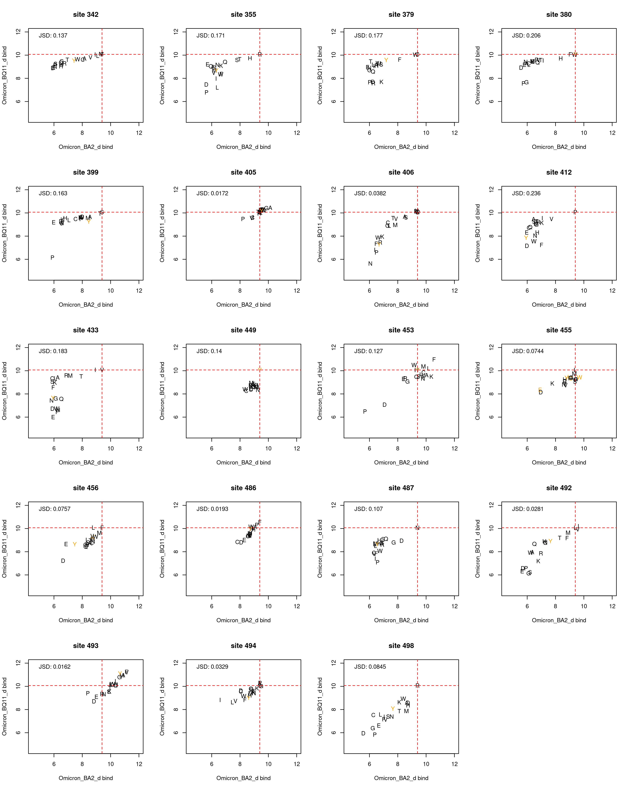

``` r
par(mfrow=c(5,4))
plot_scatter(site=342,"Omicron_BA2","Omicron_XBB15")
plot_scatter(site=355,"Omicron_BA2","Omicron_XBB15")
plot_scatter(site=379,"Omicron_BA2","Omicron_XBB15")
plot_scatter(site=380,"Omicron_BA2","Omicron_XBB15")
plot_scatter(site=399,"Omicron_BA2","Omicron_XBB15")
plot_scatter(site=405,"Omicron_BA2","Omicron_XBB15")
plot_scatter(site=406,"Omicron_BA2","Omicron_XBB15")
plot_scatter(site=412,"Omicron_BA2","Omicron_XBB15")
plot_scatter(site=433,"Omicron_BA2","Omicron_XBB15")
plot_scatter(site=449,"Omicron_BA2","Omicron_XBB15")
plot_scatter(site=453,"Omicron_BA2","Omicron_XBB15")
plot_scatter(site=455,"Omicron_BA2","Omicron_XBB15")
plot_scatter(site=456,"Omicron_BA2","Omicron_XBB15")
plot_scatter(site=486,"Omicron_BA2","Omicron_XBB15")
plot_scatter(site=487,"Omicron_BA2","Omicron_XBB15")
plot_scatter(site=492,"Omicron_BA2","Omicron_XBB15")
plot_scatter(site=493,"Omicron_BA2","Omicron_XBB15")
plot_scatter(site=494,"Omicron_BA2","Omicron_XBB15")
plot_scatter(site=498,"Omicron_BA2","Omicron_XBB15")

invisible(dev.print(pdf, paste(config$epistatic_shifts_dir,"/bg-scatters_Omicron_XBB15-v-BA2_shifts.pdf",sep=""),useDingbats=F))
```

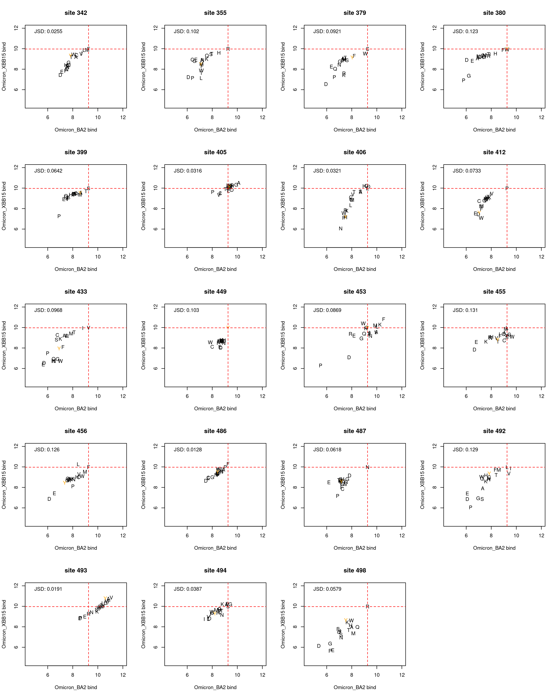
Look at interesting sites 453, 455, 456 that might be interacting with
R493Q reversion

``` r
par(mfrow=c(5,3))
plot_scatter(site=453,"Omicron_BA2","Omicron_XBB15")
plot_scatter(site=455,"Omicron_BA2","Omicron_XBB15")
plot_scatter(site=456,"Omicron_BA2","Omicron_XBB15")
plot_scatter(site=453,"Omicron_BA1","Omicron_XBB15")
plot_scatter(site=455,"Omicron_BA1","Omicron_XBB15")
plot_scatter(site=456,"Omicron_BA1","Omicron_XBB15")
plot_scatter(site=453,"Omicron_BA2","Omicron_BQ11")
plot_scatter(site=455,"Omicron_BA2","Omicron_BQ11")
plot_scatter(site=456,"Omicron_BA2","Omicron_BQ11")
plot_scatter(site=453,"Wuhan-Hu-1","Omicron_XBB15")
plot_scatter(site=455,"Wuhan-Hu-1","Omicron_XBB15")
plot_scatter(site=456,"Wuhan-Hu-1","Omicron_XBB15")
plot_scatter(site=453,"Beta","Omicron_BA2")
plot_scatter(site=455,"Beta","Omicron_BA2")
plot_scatter(site=456,"Beta","Omicron_BA2")
```

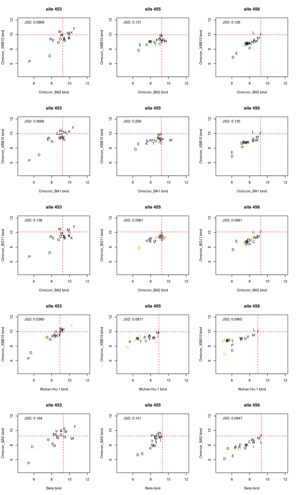

``` r
invisible(dev.print(pdf, paste(config$epistatic_shifts_dir,"/bg-scatters_453-455-456_shifts.pdf",sep=""),useDingbats=F))
```

## Line plots of JS divergence from WH1 across RBD sites

Make lineplots showing JS-D across sites for each variant compared to
WH1.

Also add gray shading for sites of escape from antibodies from our large
panel of antibodies we’ve profiled w.r.t. WH1 escape, downloaded from:
<https://raw.githubusercontent.com/jbloomlab/SARS2_RBD_Ab_escape_maps/main/processed_data/escape_data.csv>

First, define sites of substantial antibody escape

``` r
dt_mAb <- data.table(read.csv(file=config$mut_antibody_escape,stringsAsFactors = F))
dt_mAb <- unique(dt_mAb[condition_type=="antibody",.(condition, condition_type, condition_subtype, site, wildtype, site_total_escape)])

dt_mAb[,site_average_escape:=mean(site_total_escape,na.rm=T),by=c("site")]

site_escape <- unique(dt_mAb[,.(wildtype, site, site_average_escape)])

#define sites for labeling as those with an average of 0.05 normalized site-wise escape across all mAbs
sig_mAb_sites <- site_escape[site_average_escape>0.125, site]


#define some epitope classes for adding highlights
label_df <- data.frame(xmin=sig_mAb_sites-0.5,
                       xmax=sig_mAb_sites+0.5)
```

Lineplots, require minimum 3 bc for a measurement

``` r
#define focal bg for others to compare to
bg <- "Omicron_BA2"
temp <- diffs_bind[bg_1==bg,]
temp$target <- as.character(temp$bg_2)

#define colors for each bg
group.colors <- c("Wuhan-Hu-1" = cbPalette[1], "Omicron_BA1" = cbPalette[2], "Omicron_BA2" = cbPalette[8], "Alpha" = cbPalette[3], "Beta" = cbPalette[6], "Delta" = cbPalette[5], "Eta" = cbPalette[5], "Omicron_BQ11" = cbPalette[4], "Omicron_XBB15" = cbPalette[7], "SARS-CoV-1_Urbani" = "black", "SARS-CoV-2_WH1" = "black")

#define order for plotting of bgs
temp$target <- factor(temp$target,levels=c("Omicron_XBB15","Omicron_BQ11","Omicron_BA1","Delta","Beta","Alpha","Eta","Wuhan-Hu-1","SARS-CoV-1_Urbani","SARS-CoV-2_WH1"))


ggplot(data=temp, aes(x=site, y=JSD_min3bc, color=target))+
  geom_rect(data=label_df, aes(x=NULL, y=NULL, color=NULL,xmin=xmin, xmax=xmax, ymin=0,ymax=1.1*max(temp$JSD,na.rm=T)), alpha=0.2)+
  geom_line(size=1)+
  scale_color_manual(values=group.colors)+
  theme_classic()+
  scale_x_continuous(expand=c(0.01,0.01),breaks=c(331,seq(335,530,by=5)))+
  theme(axis.text.x=element_text(angle=90,hjust=1,vjust=0.6,face="bold",size=10))+
  ylab("JS divergence versus Omicron BA.2")+
  geom_text_repel(aes(label=ifelse(((JSD_min3bc > 0.15)),as.character(site),'')),size=3,color="gray40")
```

    ## Warning: Using `size` aesthetic for lines was deprecated in ggplot2 3.4.0.
    ## ℹ Please use `linewidth` instead.

    ## Warning: ggrepel: 2 unlabeled data points (too many overlaps). Consider
    ## increasing max.overlaps

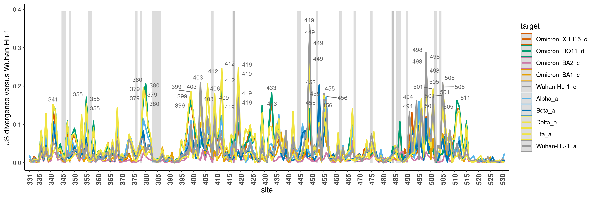

``` r
invisible(dev.print(pdf, paste(config$epistatic_shifts_dir,"/JSD_v_BA2_min3bc.pdf",sep=""),useDingbats=F))
```

    ## Warning: ggrepel: 2 unlabeled data points (too many overlaps). Consider
    ## increasing max.overlaps

Same but faceted

``` r
ggplot(data=temp, aes(x=site, y=JSD_min3bc, color=target))+
  geom_rect(data=label_df, aes(x=NULL, y=NULL, color=NULL,xmin=xmin, xmax=xmax, ymin=0,ymax=1.1*max(temp$JSD,na.rm=T)), alpha=0.2)+
  geom_line(size=1)+
  scale_color_manual(values=group.colors)+
  theme_classic()+
  scale_x_continuous(expand=c(0.01,0.01),breaks=c(331,seq(335,530,by=5)))+
  theme(axis.text.x=element_text(angle=90,hjust=1,vjust=0.6,face="bold",size=10))+
  ylab("JS divergence versus Omicron BA.2")+
  geom_text_repel(aes(label=ifelse(((JSD_min3bc > 0.15)),as.character(site),'')),size=3,color="gray40")+
  facet_wrap(~bg_2,ncol=1)
```

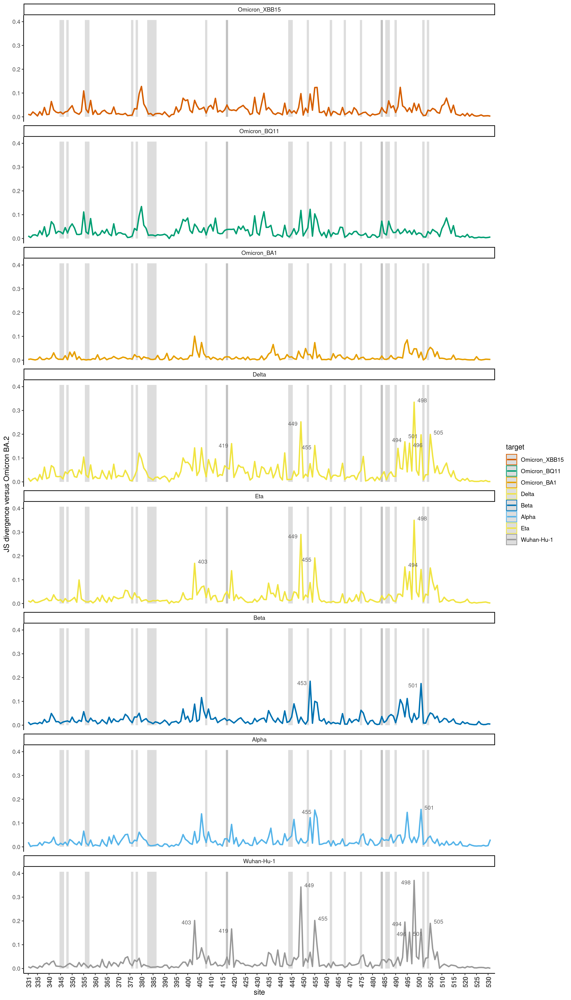

``` r
invisible(dev.print(pdf, paste(config$epistatic_shifts_dir,"/JSD_v_BA2_min3bc_faceted.pdf",sep=""),useDingbats=F))
```

Include just BA1 and WH1 from prior datasets

``` r
ggplot(data=temp[bg_2 %in% c("Omicron_BA1","Omicron_XBB15","Omicron_BQ11","Wuhan-Hu-1")], aes(x=site, y=JSD_min3bc, color=target))+
  geom_rect(data=label_df, aes(x=NULL, y=NULL, color=NULL,xmin=xmin, xmax=xmax, ymin=0,ymax=1.1*max(temp$JSD,na.rm=T)), alpha=0.2)+
  geom_line(size=1)+
  scale_color_manual(values=group.colors)+
  theme_classic()+
  scale_x_continuous(expand=c(0.01,0.01),breaks=c(331,seq(335,530,by=5)))+
  theme(axis.text.x=element_text(angle=90,hjust=1,vjust=0.6,face="bold",size=10))+
  ylab("JS divergence versus Omicron BA.2")+
  geom_text_repel(aes(label=ifelse(((JSD_min3bc > 0.15)),as.character(site),'')),size=3,color="gray40")
```

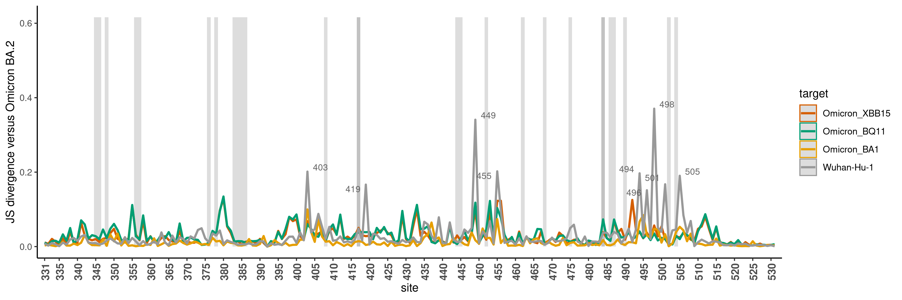

``` r
invisible(dev.print(pdf, paste(config$epistatic_shifts_dir,"/JSD_v_BA2_min3bc_Omi-reduced.pdf",sep=""),useDingbats=F))
```

Same but faceted

``` r
ggplot(data=temp[bg_2 %in% c("Omicron_BA1","Omicron_XBB15","Omicron_BQ11","Wuhan-Hu-1")], aes(x=site, y=JSD_min3bc, color=target))+
  geom_rect(data=label_df, aes(x=NULL, y=NULL, color=NULL,xmin=xmin, xmax=xmax, ymin=0,ymax=1.1*max(temp$JSD,na.rm=T)), alpha=0.2)+
  geom_line(size=1)+
  scale_color_manual(values=group.colors)+
  theme_classic()+
  scale_x_continuous(expand=c(0.01,0.01),breaks=c(331,seq(335,530,by=5)))+
  theme(axis.text.x=element_text(angle=90,hjust=1,vjust=0.6,face="bold",size=10))+
  ylab("JS divergence versus Omicron BA.2")+
  geom_text_repel(aes(label=ifelse(((JSD_min3bc > 0.1)),as.character(site),'')),size=3,color="gray40")+
  facet_wrap(~bg_2,ncol=1)
```

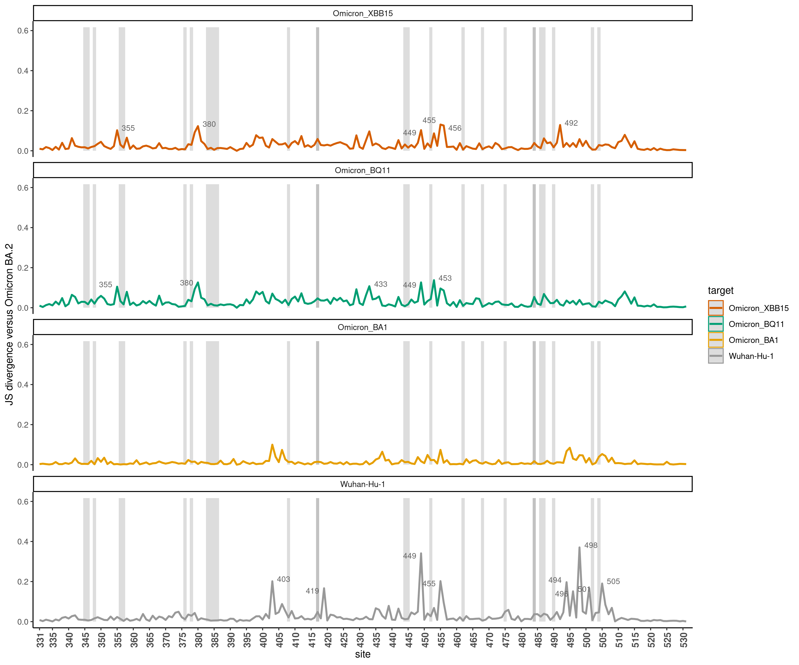

``` r
invisible(dev.print(pdf, paste(config$epistatic_shifts_dir,"/JSD_v_BA2_min3bc_Omi-reduced.pdf",sep=""),useDingbats=F))
```

Same plots but versus WH1 reference (what I’m more ‘used’ to, though
becomes outddated)

``` r
#define focal bg for others to compare to
bg <- "Wuhan-Hu-1"
temp_WH1 <- diffs_bind[bg_1==bg,]
temp_WH1$target <- as.character(temp_WH1$bg_2)

#define colors for each bg
group.colors <- c("Wuhan-Hu-1" = cbPalette[1], "Omicron_BA1" = cbPalette[2], "Omicron_BA2" = cbPalette[8], "Alpha" = cbPalette[3], "Beta" = cbPalette[6], "Delta" = cbPalette[5], "Eta" = cbPalette[5], "Omicron_BQ11" = cbPalette[4], "Omicron_XBB15" = cbPalette[7], "SARS-CoV-2_WH1" = cbPalette[1], "SARS-CoV-1_Urbani" = "black")

#define order for plotting of bgs
temp_WH1$target <- factor(temp_WH1$target,levels=c("Omicron_XBB15","Omicron_BQ11","Omicron_BA2","Omicron_BA1","Delta","Beta","Alpha","Eta", "SARS-CoV-2_WH1","SARS-CoV-1_Urbani"))


ggplot(data=temp_WH1, aes(x=site, y=JSD_min3bc, color=target))+
  geom_rect(data=label_df, aes(x=NULL, y=NULL, color=NULL,xmin=xmin, xmax=xmax, ymin=0,ymax=1.1*max(temp_WH1$JSD,na.rm=T)), alpha=0.2)+
  geom_line(size=1)+
  scale_color_manual(values=group.colors)+
  theme_classic()+
  scale_x_continuous(expand=c(0.01,0.01),breaks=c(331,seq(335,530,by=5)))+
  theme(axis.text.x=element_text(angle=90,hjust=1,vjust=0.6,face="bold",size=10))+
  ylab("JS divergence versus Wuhan-Hu-1")+
  geom_text_repel(aes(label=ifelse(((JSD_min3bc > 0.15)),as.character(site),'')),size=3,color="gray40")
```

    ## Warning: ggrepel: 7 unlabeled data points (too many overlaps). Consider
    ## increasing max.overlaps


``` r
invisible(dev.print(pdf, paste(config$epistatic_shifts_dir,"/JSD_v_WH1_min3bc.pdf",sep=""),useDingbats=F))
```

    ## Warning: ggrepel: 7 unlabeled data points (too many overlaps). Consider
    ## increasing max.overlaps

Same but faceted

``` r
ggplot(data=temp_WH1, aes(x=site, y=JSD_min3bc, color=target))+
  geom_rect(data=label_df, aes(x=NULL, y=NULL, color=NULL,xmin=xmin, xmax=xmax, ymin=0,ymax=1.1*max(temp_WH1$JSD,na.rm=T)), alpha=0.2)+
  geom_line(size=1)+
  scale_color_manual(values=group.colors)+
  theme_classic()+
  scale_x_continuous(expand=c(0.01,0.01),breaks=c(331,seq(335,530,by=5)))+
  theme(axis.text.x=element_text(angle=90,hjust=1,vjust=0.6,face="bold",size=10))+
  ylab("JS divergence versus Wuhan-Hu-1")+
  geom_text_repel(aes(label=ifelse(((JSD_min3bc > 0.15)),as.character(site),'')),size=3,color="gray40")+
  facet_wrap(~bg_2,ncol=1)
```

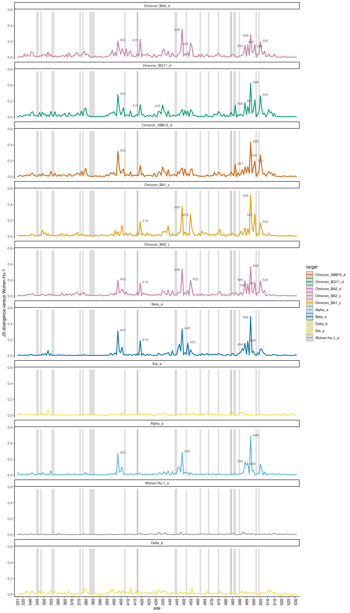

``` r
invisible(dev.print(pdf, paste(config$epistatic_shifts_dir,"/JSD_v_WH1_min3bc_faceted.pdf",sep=""),useDingbats=F))
```

Include just BA1 and WH1 from the prior VOC datasets

``` r
ggplot(data=temp_WH1[bg_2 %in% c("Omicron_BA1","Omicron_BA2","Omicron_XBB15","Omicron_BQ11")], aes(x=site, y=JSD_min3bc, color=target))+
  geom_rect(data=label_df, aes(x=NULL, y=NULL, color=NULL,xmin=xmin, xmax=xmax, ymin=0,ymax=1.1*max(temp_WH1$JSD,na.rm=T)), alpha=0.2)+
  geom_line(size=1)+
  scale_color_manual(values=group.colors)+
  theme_classic()+
  scale_x_continuous(expand=c(0.01,0.01),breaks=c(331,seq(335,530,by=5)))+
  theme(axis.text.x=element_text(angle=90,hjust=1,vjust=0.6,face="bold",size=10))+
  ylab("JS divergence versus Wuhan-Hu-1")+
  geom_text_repel(aes(label=ifelse(((JSD_min3bc > 0.15)),as.character(site),'')),size=3,color="gray40")
```

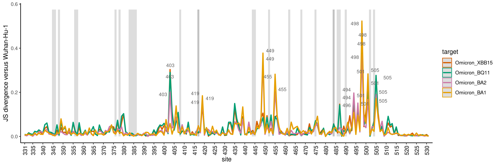

``` r
invisible(dev.print(pdf, paste(config$epistatic_shifts_dir,"/JSD_v_WH1_min3bc_Omi-reduced.pdf",sep=""),useDingbats=F))
```

Same but faceted

``` r
ggplot(data=temp_WH1[bg_2 %in% c("Omicron_BA1","Omicron_BA2","Omicron_XBB15","Omicron_BQ11")], aes(x=site, y=JSD_min3bc, color=target))+
  geom_rect(data=label_df, aes(x=NULL, y=NULL, color=NULL,xmin=xmin, xmax=xmax, ymin=0,ymax=1.1*max(temp_WH1$JSD,na.rm=T)), alpha=0.2)+
  geom_line(size=1)+
  scale_color_manual(values=group.colors)+
  theme_classic()+
  scale_x_continuous(expand=c(0.01,0.01),breaks=c(331,seq(335,530,by=5)))+
  theme(axis.text.x=element_text(angle=90,hjust=1,vjust=0.6,face="bold",size=10))+
  ylab("JS divergence versus Wuhan-Hu-1")+
  geom_text_repel(aes(label=ifelse(((JSD_min3bc > 0.1)),as.character(site),'')),size=3,color="gray40")+
  facet_wrap(~bg_2,ncol=1)
```

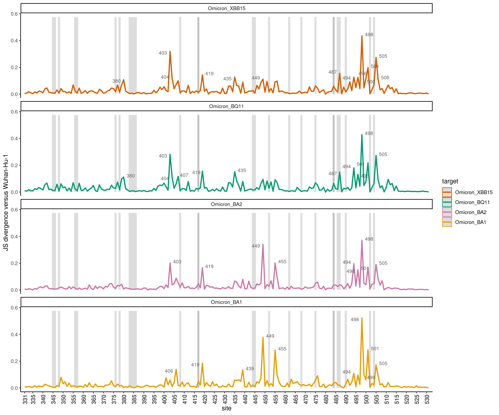

``` r
invisible(dev.print(pdf, paste(config$epistatic_shifts_dir,"/JSD_v_WH1_min3bc_Omi-reduced.pdf",sep=""),useDingbats=F))
```

Scatterplots to look for any differences in epistatic shifts v BA2
between the sub-vars?

``` r
temp2 <- dcast(temp[bg_2 %in% c("Omicron_BQ11","Omicron_XBB15")], site ~ bg_2, value.var="JSD_min3bc")

p1 <- ggplot(data=temp2, aes(x=Omicron_BQ11, y=Omicron_XBB15))+
  geom_point()+
  geom_text_repel(aes(label=ifelse((Omicron_BQ11 > 0.1 | Omicron_XBB15 > 0.1),as.character(site),'')),size=3)+
  theme_classic()+
  xlab("epistatic shift versus Omicron BA.2, Omicron BQ.1.1")+
  ylab("epistatic shift versus Omicron BA.2, Omicron XBB.1.5")

grid.arrange(p1,nrow=1)
```

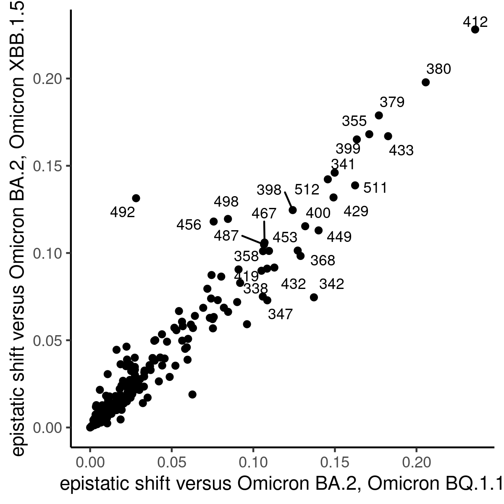

``` r
invisible(dev.print(pdf, paste(config$epistatic_shifts_dir,"/JSD_v_BA2_min3bc_BQ11-v-XBB15-scatters.pdf",sep=""),useDingbats=F))
```

Same but JSD versus WH1?

``` r
temp2_WH1 <- dcast(temp_WH1[bg_2 %in% c("Omicron_BQ11","Omicron_XBB15")], site ~ bg_2, value.var="JSD_min3bc")

p1 <- ggplot(data=temp2_WH1, aes(x=Omicron_BQ11, y=Omicron_XBB15))+
  geom_point()+
  geom_text_repel(aes(label=ifelse((Omicron_BQ11 > 0.1 | Omicron_XBB15 > 0.1),as.character(site),'')),size=3)+
  theme_classic()+
  xlab("epistatic shift versus Wuhan-Hu-1, Omicron BQ.1.1")+
  ylab("epistatic shift versus Wuhan-Hu-1, Omicron XBB.1.5")

grid.arrange(p1,nrow=1)
```

    ## Warning: ggrepel: 4 unlabeled data points (too many overlaps). Consider
    ## increasing max.overlaps

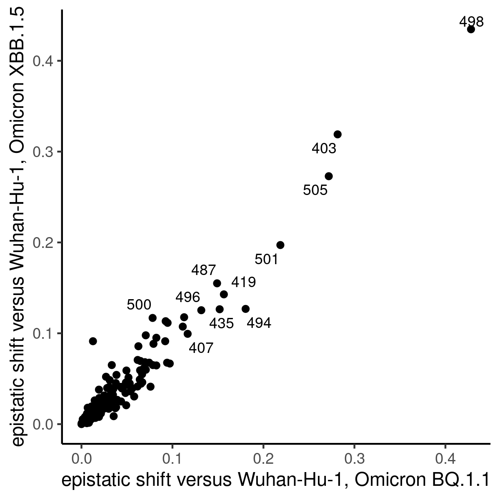

``` r
invisible(dev.print(pdf, paste(config$epistatic_shifts_dir,"/JSD_v_WH1_min3bc_BQ11-v-XBB15-scatters.pdf",sep=""),useDingbats=F))
```

    ## Warning: ggrepel: 4 unlabeled data points (too many overlaps). Consider
    ## increasing max.overlaps

## Map divergence to pdb structure

First, bind

``` r
pdb_wh1 <- read.pdb(file=config$pdb_6m0j)
```

    ##    PDB has ALT records, taking A only, rm.alt=TRUE

``` r
#iterate through backgrounds, output a pdb comparing its divergence to WH1 (using min3bc)
for(s in unique(dt$target)){
  b <- rep(0, length(pdb_wh1$atom$b))
  for(i in 1:nrow(pdb_wh1$atom)){
    if(pdb_wh1$atom$chain[i]=="E"){
      res <- pdb_wh1$atom$resno[i]
      JSD <- diffs_bind[bg_1=="Wuhan-Hu-1" & bg_2==s & site==res, JSD_min3bc]
      if(length(JSD)>0){
        b[i] <- JSD
      }
    }
  }
  write.pdb(pdb=pdb_wh1, file=paste(config$epistatic_shifts_dir,"/pdbs/",s,"_v_WH1_JSD-min3bc.pdb",sep=""), b=b)
}
```

And vs BA2

``` r
pdb_wh1 <- read.pdb(file=config$pdb_6m0j)
```

    ##    PDB has ALT records, taking A only, rm.alt=TRUE

``` r
#iterate through backgrounds, output a pdb comparing its divergence to BA2 (using min3bc)
for(s in unique(dt$target)){
  b <- rep(0, length(pdb_wh1$atom$b))
  for(i in 1:nrow(pdb_wh1$atom)){
    if(pdb_wh1$atom$chain[i]=="E"){
      res <- pdb_wh1$atom$resno[i]
      JSD <- diffs_bind[bg_1=="Omicron_BA2" & bg_2==s & site==res, JSD_min3bc]
      if(length(JSD)>0){
        b[i] <- JSD
      }
    }
  }
  write.pdb(pdb=pdb_wh1, file=paste(config$epistatic_shifts_dir,"/pdbs/",s,"_v_BA2_JSD-min3bc.pdb",sep=""), b=b)
}
```

repeat for expression measures, first vs WH1

``` r
pdb_wh1 <- read.pdb(file=config$pdb_6m0j)
```

    ##    PDB has ALT records, taking A only, rm.alt=TRUE

``` r
#iterate through backgrounds, output a pdb comparing its divergence to WH1 (using min3bc)
for(s in unique(dt$target)){
  b <- rep(0, length(pdb_wh1$atom$b))
  for(i in 1:nrow(pdb_wh1$atom)){
    if(pdb_wh1$atom$chain[i]=="E"){
      res <- pdb_wh1$atom$resno[i]
      JSD <- diffs_expr[bg_1=="Wuhan-Hu-1" & bg_2==s & site==res, JSD_min3bc]
      if(length(JSD)>0){
        b[i] <- JSD
      }
    }
  }
  write.pdb(pdb=pdb_wh1, file=paste(config$epistatic_shifts_dir,"/pdbs/",s,"_v_WH1_JSD-min3bc_expr.pdb",sep=""), b=b)
}
```

And, vs BA2

``` r
pdb_wh1 <- read.pdb(file=config$pdb_6m0j)
```

    ##    PDB has ALT records, taking A only, rm.alt=TRUE

``` r
#iterate through backgrounds, output a pdb comparing its divergence to WH1 (using min3bc)
for(s in unique(dt$target)){
  b <- rep(0, length(pdb_wh1$atom$b))
  for(i in 1:nrow(pdb_wh1$atom)){
    if(pdb_wh1$atom$chain[i]=="E"){
      res <- pdb_wh1$atom$resno[i]
      JSD <- diffs_expr[bg_1=="Omicron_BA2" & bg_2==s & site==res, JSD_min3bc]
      if(length(JSD)>0){
        b[i] <- JSD
      }
    }
  }
  write.pdb(pdb=pdb_wh1, file=paste(config$epistatic_shifts_dir,"/pdbs/",s,"_v_BA2_JSD-min3bc_expr.pdb",sep=""), b=b)
}
```

## Multidimensional scaling visualization of epistatic drift

Want to use MDS to plot trajectory of epistatic drift among all pairs of
variants. The goal of this is to illustrate in 2D the distance in
vectors of mutational effects between each pair of variants that we’ve
profiled. We will do this by deriving a “complete” epistatic shift
metric between each pair of variants that integrates across all sites,
and use this as the dissimilarity metric for MDS projection. We could
also do this on a site-by-site basis if we wanted to illustrate how
different sites show different patterns in their epistatic drift

``` r
#For each pair, have sitewise epistatic shift metrics. Compute (mean, root-mean-squared, L2 norm, L3 of JSD for each RBD pair across all sites, and use that as the dissimilarity?

#if wanting to remove the WH1 dimer data (used as control to make sure selecting an MDS condition where WH1 monomer and dimer look similar since SARS1 data is dimer)
diffs_bind <- diffs_bind[bg_1 != "SARS-CoV-2_WH1" & bg_2 != "SARS-CoV-2_WH1"]

#make matrix to host these dissimilarities
dissim <- matrix(0,nrow=length(unique(diffs_bind$bg_1)), ncol=length(unique(diffs_bind$bg_1)))
rownames(dissim) <- unique(diffs_bind$bg_1)
colnames(dissim) <- unique(diffs_bind$bg_1)

dissim_mean <- dissim
dissim_RMS <- dissim
dissim_L2 <- dissim
dissim_L3 <- dissim
dissim_L4 <- dissim

for(row in rownames(dissim)){
  for(col in colnames(dissim)){
    if(row != col){
      data <- diffs_bind[bg_1==row & bg_2==col]
      dissim_mean[row,col] <- mean(data$JSD_min3bc,na.rm=T)
      dissim_RMS[row,col] <- sqrt(mean(data$JSD_min3bc^2,na.rm=T))
      dissim_L2[row,col] <- sum(data$JSD_min3bc^2)^(1/2)
      dissim_L3[row,col] <- sum(data$JSD_min3bc^3)^(1/3)
      dissim_L4[row,col] <- sum(data$JSD_min3bc^4)^(1/4)
    }
  }
}

mds_mean <- as.data.frame(cmdscale(dissim_mean))
mds_RMS <- as.data.frame(cmdscale(dissim_RMS))
mds_L2 <- as.data.frame(cmdscale(dissim_L2))
mds_L3 <- as.data.frame(cmdscale(dissim_L3))
mds_L4 <- as.data.frame(cmdscale(dissim_L4))

colnames(mds_mean) <- c("Dim.1","Dim.2")
colnames(mds_RMS) <- c("Dim.1","Dim.2")
colnames(mds_L2) <- c("Dim.1","Dim.2")
colnames(mds_L3) <- c("Dim.1","Dim.2")
colnames(mds_L4) <- c("Dim.1","Dim.2")

mds_mean$label <- rownames(mds_mean)
mds_RMS$label <- rownames(mds_RMS)
mds_L2$label <- rownames(mds_L2)
mds_L3$label <- rownames(mds_L3)
mds_L4$label <- rownames(mds_L4)

p_mean <- ggplot(data=mds_mean, aes(x = Dim.1, y = Dim.2))+
  geom_point(size=5)+
  geom_text_repel(aes(label=label))+
  xlab("")+
  ylab("")+
  theme_classic()+
  ggtitle("mean")+
  theme_void()+
  theme(panel.border=element_rect(color="black",fill=NA,linewidth=1))

p_RMS <- ggplot(data=mds_RMS, aes(x = Dim.2, y = Dim.1))+
  geom_point(size=5)+
  geom_text_repel(aes(label=label))+
  xlab("")+
  ylab("")+
  theme_classic()+
  ggtitle("RMS")+
  theme_void()+
  theme(panel.border=element_rect(color="black",fill=NA,linewidth=1))
  

p_L2 <- ggplot(data=mds_L2, aes(x = Dim.2, y = Dim.1))+
  geom_point(size=5)+
  geom_text_repel(aes(label=label))+
  xlab("")+
  ylab("")+
  theme_classic()+
  ggtitle("L2")+
  theme_void()+
  theme(panel.border=element_rect(color="black",fill=NA,linewidth=1))

p_L3 <- ggplot(data=mds_L3, aes(x = Dim.2, y = Dim.1))+
  geom_point(size=5)+
  geom_text_repel(aes(label=label))+
  xlab("")+
  ylab("")+
  theme_classic()+
  ggtitle("L3")+
  theme_void()+
  theme(panel.border=element_rect(color="black",fill=NA,linewidth=1))

p_L4 <- ggplot(data=mds_L4, aes(x = Dim.2, y = Dim.1))+
  geom_point(size=5)+
  geom_text_repel(aes(label=label))+
  xlab("")+
  ylab("")+
  ggtitle("L4")+
  theme_void()+
  theme(panel.border=element_rect(color="black",fill=NA,linewidth=1))

grid.arrange(p_mean,p_RMS,nullGrob(),p_L2,p_L3,p_L4,nrow=2)
```

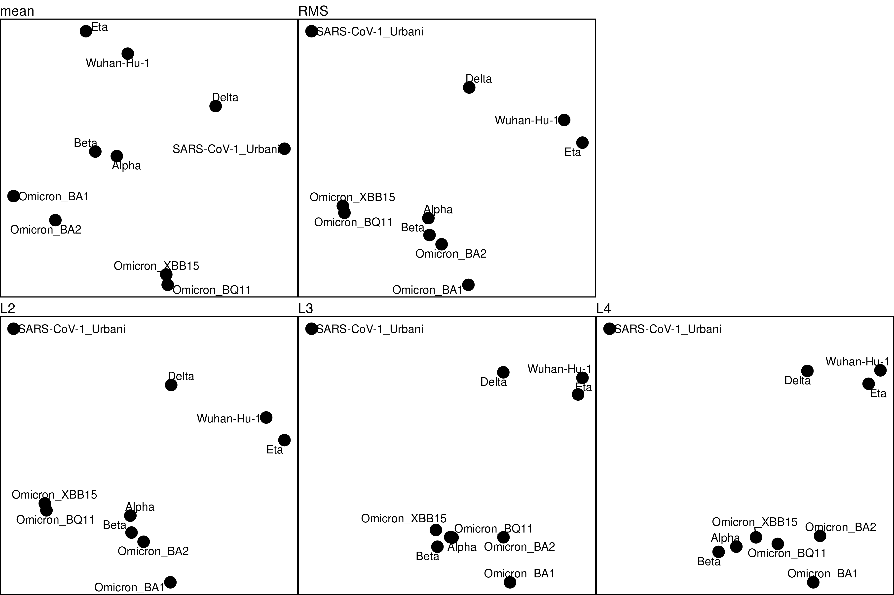

``` r
invisible(dev.print(pdf, paste(config$epistatic_shifts_dir,"/MDS-scatters.pdf",sep=""),useDingbats=F))
```

Here’s what the per-site epistatic shifts look like e.g. squared (what
gets summed into L2) and below, cubed (L3)

``` r
ggplot(data=temp_WH1, aes(x=site, y=JSD_min3bc^2, color=target))+
  geom_rect(data=label_df, aes(x=NULL, y=NULL, color=NULL,xmin=xmin, xmax=xmax, ymin=0,ymax=1.1*max(temp_WH1$JSD^2,na.rm=T)), alpha=0.2)+
  geom_line(size=1)+
  scale_color_manual(values=group.colors)+
  theme_classic()+
  scale_x_continuous(expand=c(0.01,0.01),breaks=c(331,seq(335,530,by=5)))+
  theme(axis.text.x=element_text(angle=90,hjust=1,vjust=0.6,face="bold",size=10))+
  ylab("JS divergence versus Wuhan-Hu-1")+
  geom_text_repel(aes(label=ifelse(((JSD_min3bc^2 > 0.05)),as.character(site),'')),size=3,color="gray40")+
  facet_wrap(~bg_2,ncol=1)
```

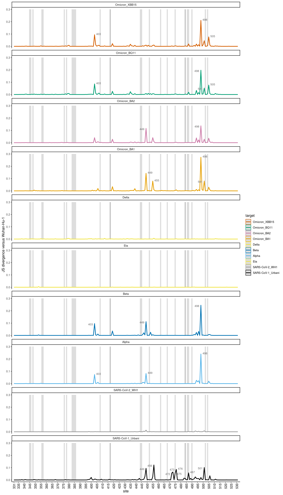

``` r
invisible(dev.print(pdf, paste(config$epistatic_shifts_dir,"/JSD_v_WH1_min3bc_faceted_square.pdf",sep=""),useDingbats=F))
```

``` r
ggplot(data=temp_WH1, aes(x=site, y=JSD_min3bc^3, color=target))+
  geom_rect(data=label_df, aes(x=NULL, y=NULL, color=NULL,xmin=xmin, xmax=xmax, ymin=0,ymax=1.1*max(temp_WH1$JSD^3,na.rm=T)), alpha=0.2)+
  geom_line(size=1)+
  scale_color_manual(values=group.colors)+
  theme_classic()+
  scale_x_continuous(expand=c(0.01,0.01),breaks=c(331,seq(335,530,by=5)))+
  theme(axis.text.x=element_text(angle=90,hjust=1,vjust=0.6,face="bold",size=10))+
  ylab("JS divergence versus Wuhan-Hu-1")+
  geom_text_repel(aes(label=ifelse(((JSD_min3bc^3 > 0.01)),as.character(site),'')),size=3,color="gray40")+
  facet_wrap(~bg_2,ncol=1)
```


``` r
invisible(dev.print(pdf, paste(config$epistatic_shifts_dir,"/JSD_v_WH1_min3bc_faceted_cube.pdf",sep=""),useDingbats=F))
```

Let’s use RMS – looks good and also procedurally the easiest to explain.
Let’s color points by key features?

``` r
mds_RMS$seq_diff <- c(22, 20, 16, 15, 2, 1, 3, 1, 0, 25) #SARS1 is 52 differences but I'll collapse scale to >=25

p_RMS_seq_dissim <- ggplot(data=mds_RMS, aes(x = Dim.2, y = Dim.1, color = seq_diff))+
  geom_point(size=5)+
  geom_text_repel(aes(label=label))+
  xlab("")+
  ylab("")+
  theme_classic()+
  ggtitle("RMS")+
  theme_void()+
  theme(panel.border=element_rect(color="black",fill=NA,linewidth=1))+
  scale_color_viridis_c()  # Apply the viridis color scale

p_RMS_seq_dissim
```

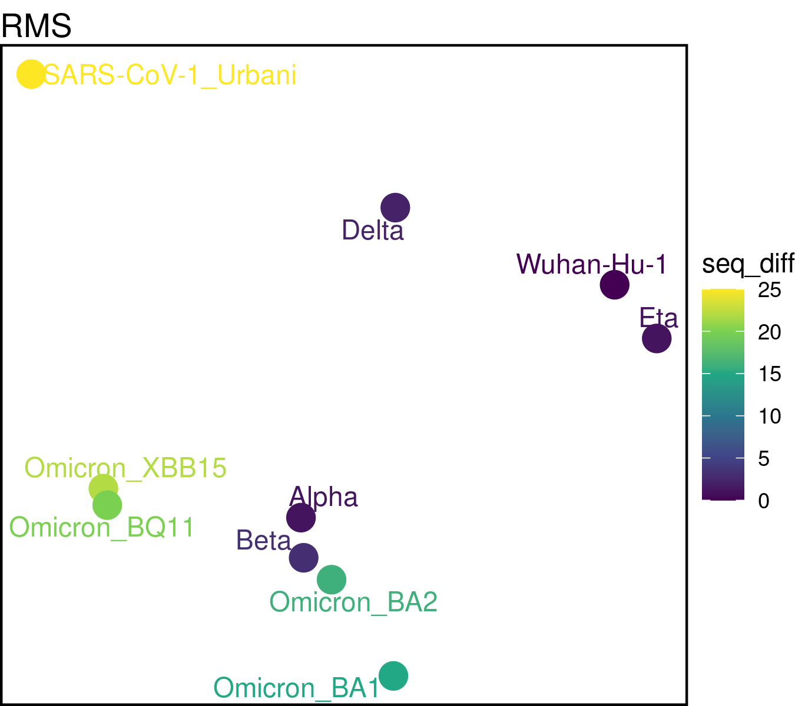

``` r
invisible(dev.print(pdf, paste(config$epistatic_shifts_dir,"/MDS-scatter_color-by-seq-similarity.pdf",sep=""),useDingbats=F))
```

What about antigenic distances? I extracted the antigenic distances
reported in Haagmans lab antigenic cartography based on immunization and
serum neuts from a hamster model in [this
paper](https://www.thelancet.com/journals/lanmic/article/PIIS2666-5247(22)00384-6/fulltext#%20)
and PCA of serum neuts from Yunlong Cao in [this
paper](https://www.nature.com/articles/s41586-022-05644-7). I extracted
values, transformed the Cao measurements by the linear trendline linking
the two measurement sets (R2 \~ 0.87), and averaged the two
measurements. Eta (truly Zeta) and SARS1 were only measured each in one
of the two datasets (Eta in Haagmans, SARS1 in Cao). Also note, XBB.1.5
is data from XBB.1 alone, not the .5 derivative.

``` r
mds_RMS$antigenic_diff <- c(15.515, 15.645, 8.206, 9.326, 2.766, 4.166, 1.795, 2.076, 0, 14.908)

p_RMS_antigenic_dissim <- ggplot(data=mds_RMS, aes(x = Dim.2, y = Dim.1, color = antigenic_diff))+
  geom_point(size=5)+
  geom_text_repel(aes(label=label))+
  xlab("")+
  ylab("")+
  theme_classic()+
  ggtitle("RMS")+
  theme_void()+
  theme(panel.border=element_rect(color="black",fill=NA,linewidth=1))+
  scale_color_viridis_c(option="plasma")  # Apply the viridis color scale

p_RMS_antigenic_dissim
```

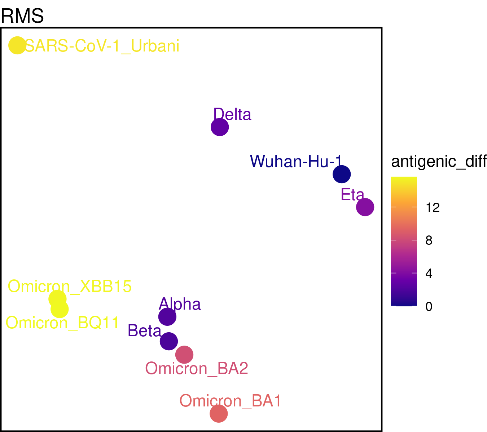

``` r
invisible(dev.print(pdf, paste(config$epistatic_shifts_dir,"/MDS-scatter_color-by-antigenic-distance.pdf",sep=""),useDingbats=F))
```
