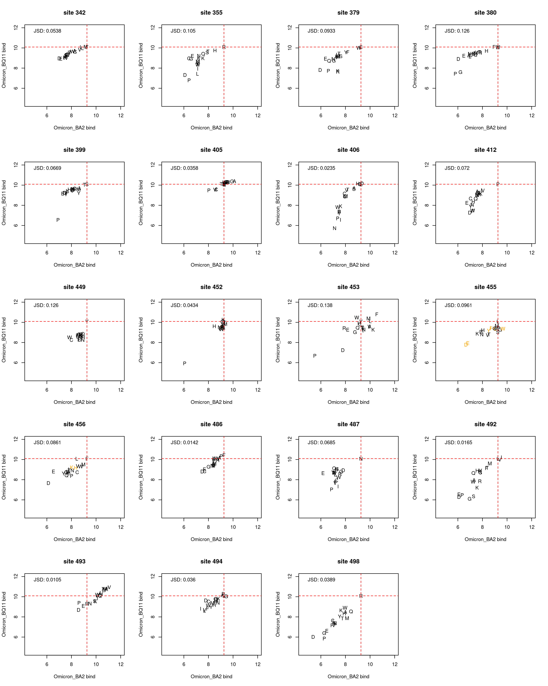
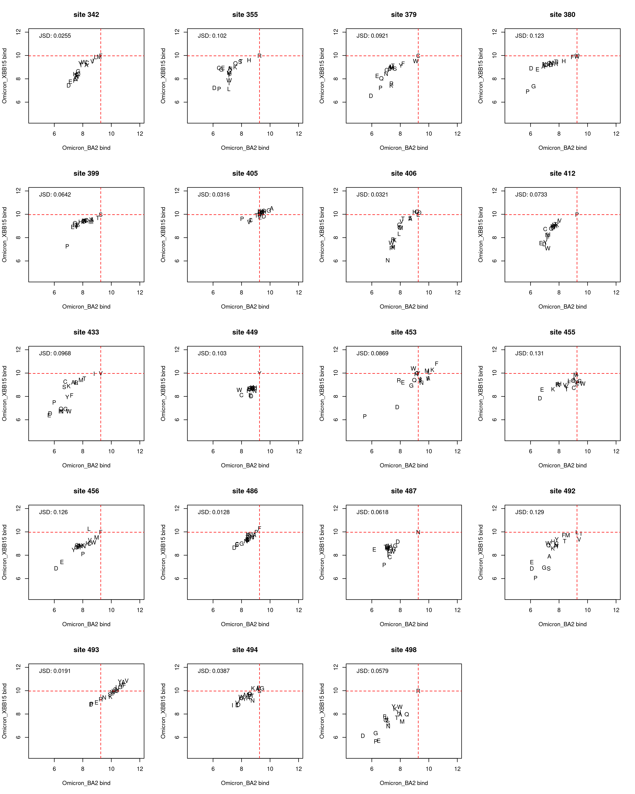
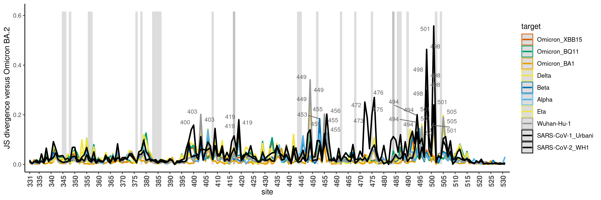
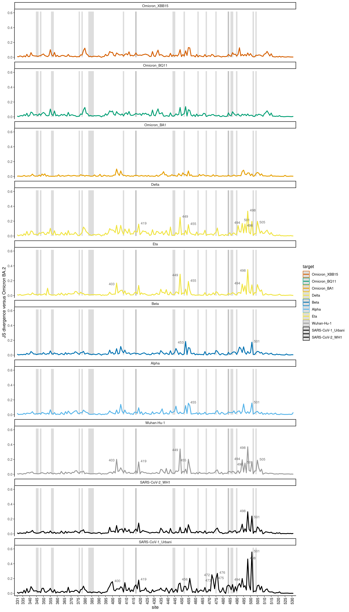
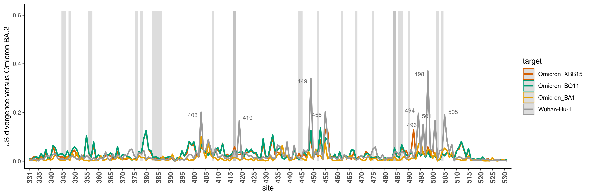
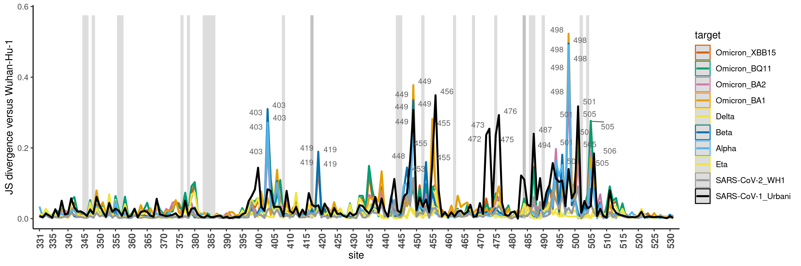
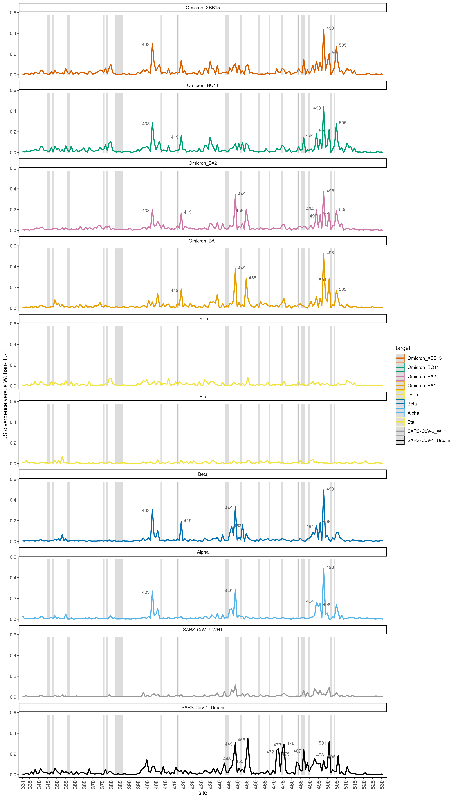
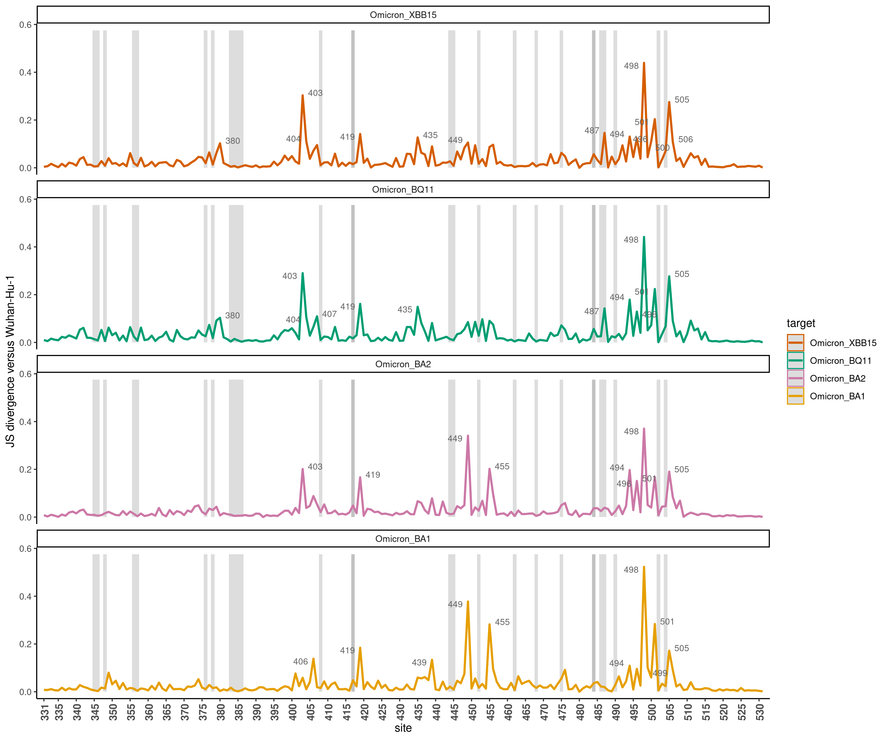
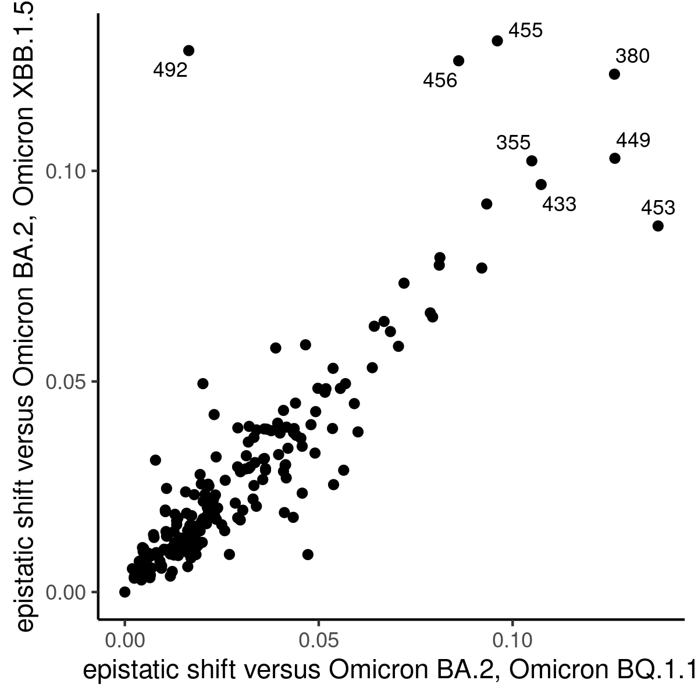
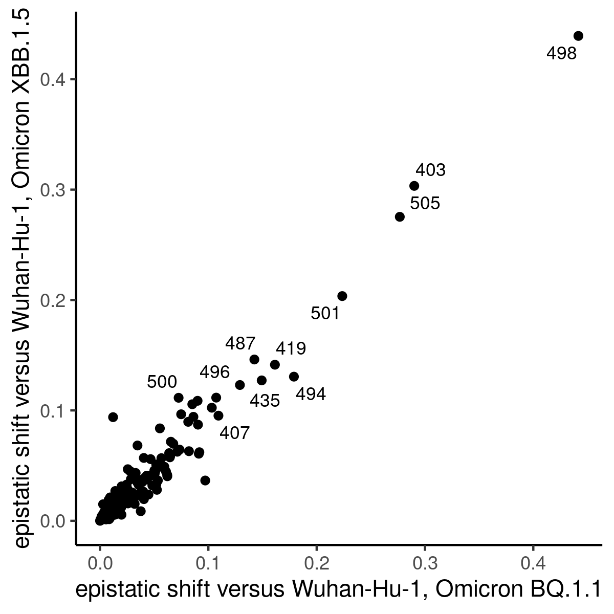

Shifts in mutation effects among variant backgrounds
================
Tyler Starr
5/30/2023

- <a href="#setup" id="toc-setup">Setup</a>
- <a
  href="#calculate-site-wise-jensen-shannon-divergence-a-metric-of-divergence-in-site-specific-mutational-profiles"
  id="toc-calculate-site-wise-jensen-shannon-divergence-a-metric-of-divergence-in-site-specific-mutational-profiles">Calculate
  site-wise Jensen-Shannon divergence, a metric of divergence in
  site-specific mutational profiles</a>
- <a href="#line-plots-of-js-divergence-from-wh1-across-rbd-sites"
  id="toc-line-plots-of-js-divergence-from-wh1-across-rbd-sites">Line
  plots of JS divergence from WH1 across RBD sites</a>
- <a href="#map-divergence-to-pdb-structure"
  id="toc-map-divergence-to-pdb-structure">Map divergence to pdb
  structure</a>

This notebook analyzes sites whose mutation effects deviate most
strongly among the variant RBD backgrounds.

``` r
#list of packages to install/load
packages = c("yaml","data.table","tidyverse","gridExtra","bio3d","ggridges","ggrepel","GGally")
#install any packages not already installed
installed_packages <- packages %in% rownames(installed.packages())
if(any(installed_packages == F)){
  install.packages(packages[!installed_packages],
                   lib=c(paste("/uufs/chpc.utah.edu/common/home/",Sys.getenv("USER"),"/RLibs/",Sys.getenv("R_VERSION"),sep="")),
                   repos=c("http://cran.us.r-project.org"))
}
#load packages
invisible(lapply(packages, library, character.only=T))

knitr::opts_chunk$set(echo = T)
knitr::opts_chunk$set(dev.args = list(png = list(type = "cairo")))

#read in config file
config <- read_yaml("config.yaml")

#make output directory
if(!file.exists(config$epistatic_shifts_dir)){
  dir.create(file.path(config$epistatic_shifts_dir))
}

#make pdb output directory
if(!file.exists(paste(config$epistatic_shifts_dir,"/pdbs/",sep=""))){
  dir.create(file.path(paste(config$epistatic_shifts_dir,"/pdbs/",sep="")))
}
```

Session info for reproducing environment:

``` r
sessionInfo()
```

    ## R version 4.1.3 (2022-03-10)
    ## Platform: x86_64-pc-linux-gnu (64-bit)
    ## Running under: Rocky Linux 8.5 (Green Obsidian)
    ## 
    ## Matrix products: default
    ## BLAS/LAPACK: /uufs/chpc.utah.edu/sys/spack/linux-rocky8-nehalem/gcc-8.5.0/intel-oneapi-mkl-2021.4.0-h43nkmwzvaltaa6ii5l7n6e7ruvjbmnv/mkl/2021.4.0/lib/intel64/libmkl_rt.so.1
    ## 
    ## locale:
    ##  [1] LC_CTYPE=en_US.UTF-8       LC_NUMERIC=C              
    ##  [3] LC_TIME=en_US.UTF-8        LC_COLLATE=en_US.UTF-8    
    ##  [5] LC_MONETARY=en_US.UTF-8    LC_MESSAGES=en_US.UTF-8   
    ##  [7] LC_PAPER=en_US.UTF-8       LC_NAME=C                 
    ##  [9] LC_ADDRESS=C               LC_TELEPHONE=C            
    ## [11] LC_MEASUREMENT=en_US.UTF-8 LC_IDENTIFICATION=C       
    ## 
    ## attached base packages:
    ## [1] stats     graphics  grDevices utils     datasets  methods   base     
    ## 
    ## other attached packages:
    ##  [1] GGally_2.1.2      ggrepel_0.9.1     ggridges_0.5.4    bio3d_2.4-4      
    ##  [5] gridExtra_2.3     forcats_0.5.1     stringr_1.4.0     dplyr_1.0.8      
    ##  [9] purrr_0.3.4       readr_2.1.2       tidyr_1.2.0       tibble_3.1.6     
    ## [13] ggplot2_3.4.1     tidyverse_1.3.1   data.table_1.14.2 yaml_2.3.5       
    ## 
    ## loaded via a namespace (and not attached):
    ##  [1] Rcpp_1.0.8         lubridate_1.8.0    assertthat_0.2.1   digest_0.6.29     
    ##  [5] utf8_1.2.2         R6_2.5.1           cellranger_1.1.0   plyr_1.8.6        
    ##  [9] backports_1.4.1    reprex_2.0.1       evaluate_0.15      httr_1.4.6        
    ## [13] pillar_1.7.0       rlang_1.0.6        readxl_1.3.1       rstudioapi_0.13   
    ## [17] rmarkdown_2.13     munsell_0.5.0      broom_0.7.12       compiler_4.1.3    
    ## [21] modelr_0.1.8       xfun_0.30          pkgconfig_2.0.3    htmltools_0.5.2   
    ## [25] tidyselect_1.1.2   reshape_0.8.8      fansi_1.0.2        crayon_1.5.0      
    ## [29] tzdb_0.2.0         dbplyr_2.1.1       withr_2.5.0        grid_4.1.3        
    ## [33] jsonlite_1.8.4     gtable_0.3.0       lifecycle_1.0.3    DBI_1.1.2         
    ## [37] magrittr_2.0.2     scales_1.2.1       cli_3.6.0          stringi_1.7.6     
    ## [41] fs_1.5.2           xml2_1.3.3         ellipsis_0.3.2     generics_0.1.2    
    ## [45] vctrs_0.5.2        RColorBrewer_1.1-2 tools_4.1.3        glue_1.6.2        
    ## [49] hms_1.1.1          parallel_4.1.3     fastmap_1.1.0      colorspace_2.0-3  
    ## [53] rvest_1.0.2        knitr_1.37         haven_2.4.3

Define colorblind-friendly palette

``` r
# The palette with grey:
cbPalette <- c("#999999", "#E69F00", "#56B4E9", "#009E73", "#F0E442", 
               "#0072B2", "#D55E00", "#CC79A7")
# The palette with black
cbbPalette <- c("#000000", "#E69F00", "#56B4E9", "#009E73", "#F0E442", 
                "#0072B2", "#D55E00", "#CC79A7")
```

## Setup

Read in tables of mutant measurements from current study and prior VOCs
DMS datasets.

``` r
dt <- data.table(read.csv(file=config$final_variant_scores_mut_file,stringsAsFactors=F))

#add the deletion character for the earlier libraries when I didn't do indel
for(bg in c("Omicron_BA1_c","Omicron_BA2_c","Wuhan-Hu-1_c","Beta_a","Eta_a","Alpha_a","Wuhan-Hu-1_a","Delta_b")){
  for(pos in unique(dt$position)){
    wt <- dt[target==bg & position==pos & wildtype==mutant,wildtype]
    dt <- rbind(dt, data.frame(target=bg,position=pos,mutant="-",wildtype=wt,mutation=paste(wt,pos,"-",sep=""),n_bc_bind=0,n_libs_bind=0,n_bc_expr=0,n_libs_expr=0),fill=T)
  }
}
setkey(dt,target,position,mutant)
```

## Calculate site-wise Jensen-Shannon divergence, a metric of divergence in site-specific mutational profiles

For each pair of backgrounds, at each site I want to compute the
Jensen-Shannon divergence between the profile of mutation effects of all
mutations at the site. (Remove any measurements determined for \<3 or
\<5 bc to avoid measurements with lower precision driving noise in the
global JSD metric.)

``` r
#define a minbc bind measurement that requires three barcodes be averaged for a final determination, otherwise change to NA
dt[,bind_min3bc := bind]
dt[n_bc_bind < 3, bind_min3bc := NA]

dt[,bind_min5bc := bind]
dt[n_bc_bind < 5, bind_min5bc := NA]

#define a minbc expr measurement that requires three barcodes be averaged for a final determination, otherwise change to NA
dt[,expr_min3bc := expr]
dt[n_bc_expr < 3, expr_min3bc := NA]

dt[,expr_min5bc := expr]
dt[n_bc_expr < 5, expr_min5bc := NA]

#define a function for computing J-S divergence/distance between two affinity vectors (where affinity is given currently as log10-Kd)
JS <- function(vec1,vec2){
  vec1_pair <- vec1[!is.na(vec1) & !is.na(vec2)]
  vec2_pair <- vec2[!is.na(vec1) & !is.na(vec2)]
  pi1 <- 10^(vec1_pair)/sum(10^(vec1_pair))
  pi2 <- 10^(vec2_pair)/sum(10^(vec2_pair))
  n <- 0.5 * (pi1+pi2)
  JS <- 0.5 * (sum(pi1*log(pi1/n)) + sum(pi2*log(pi2/n)))
  #return(sqrt(JS)) #if doing distance
  return(JS) #if doing divergence
}

#first, for bind measurements
#data table for storing difference in correlation in profiles between bg pairs at each site
#generate table with all combinations of bg_1 and bg_2 for each site
diffs_bind <- data.table(expand.grid(site=unique(dt$position),bg_2=c("Omicron_BA2_d","Omicron_BQ11_d","Omicron_XBB15_d","Omicron_BA1_c","Omicron_BA2_c","Wuhan-Hu-1_c","Beta_a","Eta_a","Alpha_a","Wuhan-Hu-1_a","Delta_b"),bg_1=c("Omicron_BA2_d","Omicron_BQ11_d","Omicron_XBB15_d","Omicron_BA1_c","Omicron_BA2_c","Wuhan-Hu-1_c","Beta_a","Eta_a","Alpha_a","Wuhan-Hu-1_a","Delta_b")))

#remove duplicates where bg_1 and _2 the same
diffs_bind <- diffs_bind[bg_1 != bg_2,]

#loop through and compute JSD for each site for each pair of bgs, for bind metric
diffs_bind$JSD <- as.numeric(NA) #jensen-shannon divergence, from raw bind values (lower limit 5)
diffs_bind$JSD_min3bc <- as.numeric(NA) #jensen-shannon divergence, require a minimum of 3 bcs averaged
diffs_bind$JSD_min5bc <- as.numeric(NA) #jensen-shannon divergence, require a minimum of 5 bcs averaged
for(i in 1:nrow(diffs_bind)){
  x_uncens <- dt[target==diffs_bind[i,bg_1] & position==diffs_bind[i,site],bind]
  y_uncens <- dt[target==diffs_bind[i,bg_2] & position==diffs_bind[i,site],bind]
  x_min3bc <- dt[target==diffs_bind[i,bg_1] & position==diffs_bind[i,site],bind_min3bc]
  y_min3bc <- dt[target==diffs_bind[i,bg_2] & position==diffs_bind[i,site],bind_min3bc]
  x_min5bc <- dt[target==diffs_bind[i,bg_1] & position==diffs_bind[i,site],bind_min5bc]
  y_min5bc <- dt[target==diffs_bind[i,bg_2] & position==diffs_bind[i,site],bind_min5bc]
  diffs_bind[i,JSD := JS(x_uncens,y_uncens)]
  diffs_bind[i,JSD_min3bc := JS(x_min3bc,y_min3bc)]
  diffs_bind[i,JSD_min5bc := JS(x_min3bc,y_min5bc)]
}

#repeat for expr measurements
#data table for storign difference in correlation in profiles between bg pairs at each site
#generate table with all combinations of bg_1 and bg_2 for each site
diffs_expr <- data.table(expand.grid(site=unique(dt$position),bg_2=c("Omicron_BA2_d","Omicron_BQ11_d","Omicron_XBB15_d","Omicron_BA1_c","Omicron_BA2_c","Wuhan-Hu-1_c","Beta_a","Eta_a","Alpha_a","Wuhan-Hu-1_a","Delta_b"),bg_1=c("Omicron_BA2_d","Omicron_BQ11_d","Omicron_XBB15_d","Omicron_BA1_c","Omicron_BA2_c","Wuhan-Hu-1_c","Beta_a","Eta_a","Alpha_a","Wuhan-Hu-1_a","Delta_b")))


#remove duplicates where either bg_1 and _2 the same
diffs_expr <- diffs_expr[bg_1 != bg_2,]

#loop through and compute JSD for each site for each pair of bgs, for expr metric
diffs_expr$JSD <- as.numeric(NA) #jensen-shannon divergence, from raw expr values
diffs_expr$JSD_min3bc <- as.numeric(NA) #jensen-shannon divergence, require a minimum of 3 bcs averaged
diffs_expr$JSD_min5bc <- as.numeric(NA) #jensen-shannon divergence, require a minimum of 5 bcs averaged
for(i in 1:nrow(diffs_expr)){
  x_uncens <- dt[target==diffs_expr[i,bg_1] & position==diffs_expr[i,site],expr]
  y_uncens <- dt[target==diffs_expr[i,bg_2] & position==diffs_expr[i,site],expr]
  x_min3bc <- dt[target==diffs_expr[i,bg_1] & position==diffs_expr[i,site],expr_min3bc]
  y_min3bc <- dt[target==diffs_expr[i,bg_2] & position==diffs_expr[i,site],expr_min3bc]
  x_min5bc <- dt[target==diffs_expr[i,bg_1] & position==diffs_expr[i,site],expr_min5bc]
  y_min5bc <- dt[target==diffs_expr[i,bg_2] & position==diffs_expr[i,site],expr_min5bc]
  diffs_expr[i,JSD := JS(x_uncens,y_uncens)]
  diffs_expr[i,JSD_min3bc := JS(x_min3bc,y_min3bc)]
  diffs_expr[i,JSD_min5bc := JS(x_min3bc,y_min5bc)]
}
```

Output file with the site-pair JS divergences.

``` r
diffs_bind[,.(bg_1,bg_2,site,JSD,JSD_min3bc,JSD_min5bc)] %>%
  mutate_if(is.numeric, round, digits=6) %>%
  write.csv(file=config$JSD_file, row.names=F,quote=F)
```

Output file with the site-pair JS divergences.

``` r
diffs_expr[,.(bg_1,bg_2,site,JSD,JSD_min3bc,JSD_min5bc)] %>%
  mutate_if(is.numeric, round, digits=6) %>%
  write.csv(file=config$JSD_expr_file, row.names=F,quote=F)
```

Plotting/visualizing:

Utility function: plot scatterplot showing affinity of each of the 20
amino acids in a pair of sites

``` r
plot_scatter <- function(site, bg1, bg2, JSD=F, JSD_min3bc=T, JSD_min5bc=F,n_bc_cutoff=3,phenotype="bind"){
  x <- dt[target==bg1 & position==site,get(phenotype)]
  x_n_bc <- dt[target==bg1 & position==site,get(paste("n_bc_",phenotype,sep=""))]
  x_ref <- dt[target==bg1 & position==site & as.character(mutant)==as.character(wildtype),get(phenotype)]
  y <- dt[target==bg2 & position==site,get(phenotype)]
  y_n_bc <- dt[target==bg2 & position==site,get(paste("n_bc_",phenotype,sep=""))]
  y_ref <- dt[target==bg2 & position==site & as.character(mutant)==as.character(wildtype),get(phenotype)]
  x_min3bc <- dt[target==bg1 & position==site,get(paste(phenotype,"_min3bc",sep=""))]
  y_min3bc <- dt[target==bg2 & position==site,get(paste(phenotype,"_min3bc",sep=""))]
  x_min5bc <- dt[target==bg1 & position==site,get(paste(phenotype,"_min5bc",sep=""))]
  y_min5bc <- dt[target==bg2 & position==site,get(paste(phenotype,"_min5bc",sep=""))]
  chars <- dt[target==bg1 & position==site,mutant]
  cols <- rep("black",20); cols[which(x_n_bc < n_bc_cutoff | y_n_bc < n_bc_cutoff)] <- "orange"
  plot(x,y, xlim=if(phenotype=="bind"){c(4.5,12)}else{c(5.5,11)},ylim=if(phenotype=="bind"){c(4.5,12)}else{c(5.5,11)},pch=chars,xlab=paste(bg1,phenotype),ylab=paste(bg2,phenotype),col=cols,main=paste("site",site))
  abline(v=x_ref,lty=2,col="red")
  abline(h=y_ref,lty=2,col="red")
  if(JSD==T){
    val <- JS(x,y)
    legend("topleft",bty="n",cex=1,legend=paste("JSD:",format(val,digits=3)))
  }else if(JSD_min3bc==T){
    val <- JS(x_min3bc,y_min3bc)
    legend("topleft",bty="n",cex=1,legend=paste("JSD:",format(val,digits=3)))
  }else if(JSD_min5bc==T){
    val <- JS(x_min5bc,y_min5bc)
    legend("topleft",bty="n",cex=1,legend=paste("JSD:",format(val,digits=3)))
  }
}
```

``` r
par(mfrow=c(5,4))
plot_scatter(site=342,"Omicron_BA2_d","Omicron_BQ11_d")
plot_scatter(site=355,"Omicron_BA2_d","Omicron_BQ11_d")
plot_scatter(site=379,"Omicron_BA2_d","Omicron_BQ11_d")
plot_scatter(site=380,"Omicron_BA2_d","Omicron_BQ11_d")
plot_scatter(site=399,"Omicron_BA2_d","Omicron_BQ11_d")
plot_scatter(site=405,"Omicron_BA2_d","Omicron_BQ11_d")
plot_scatter(site=406,"Omicron_BA2_d","Omicron_BQ11_d")
plot_scatter(site=412,"Omicron_BA2_d","Omicron_BQ11_d")
plot_scatter(site=433,"Omicron_BA2_d","Omicron_BQ11_d")
plot_scatter(site=449,"Omicron_BA2_d","Omicron_BQ11_d")
plot_scatter(site=453,"Omicron_BA2_d","Omicron_BQ11_d")
plot_scatter(site=455,"Omicron_BA2_d","Omicron_BQ11_d")
plot_scatter(site=456,"Omicron_BA2_d","Omicron_BQ11_d")
plot_scatter(site=486,"Omicron_BA2_d","Omicron_BQ11_d")
plot_scatter(site=487,"Omicron_BA2_d","Omicron_BQ11_d")
plot_scatter(site=492,"Omicron_BA2_d","Omicron_BQ11_d")
plot_scatter(site=493,"Omicron_BA2_d","Omicron_BQ11_d")
plot_scatter(site=494,"Omicron_BA2_d","Omicron_BQ11_d")
plot_scatter(site=498,"Omicron_BA2_d","Omicron_BQ11_d")

invisible(dev.print(pdf, paste(config$epistatic_shifts_dir,"/bg-scatters_Omicron_BQ11-v-BA2_shifts.pdf",sep=""),useDingbats=F))
```



``` r
par(mfrow=c(5,4))
plot_scatter(site=342,"Omicron_BA2_d","Omicron_XBB15_d")
plot_scatter(site=355,"Omicron_BA2_d","Omicron_XBB15_d")
plot_scatter(site=379,"Omicron_BA2_d","Omicron_XBB15_d")
plot_scatter(site=380,"Omicron_BA2_d","Omicron_XBB15_d")
plot_scatter(site=399,"Omicron_BA2_d","Omicron_XBB15_d")
plot_scatter(site=405,"Omicron_BA2_d","Omicron_XBB15_d")
plot_scatter(site=406,"Omicron_BA2_d","Omicron_XBB15_d")
plot_scatter(site=412,"Omicron_BA2_d","Omicron_XBB15_d")
plot_scatter(site=433,"Omicron_BA2_d","Omicron_XBB15_d")
plot_scatter(site=449,"Omicron_BA2_d","Omicron_XBB15_d")
plot_scatter(site=453,"Omicron_BA2_d","Omicron_XBB15_d")
plot_scatter(site=455,"Omicron_BA2_d","Omicron_XBB15_d")
plot_scatter(site=456,"Omicron_BA2_d","Omicron_XBB15_d")
plot_scatter(site=486,"Omicron_BA2_d","Omicron_XBB15_d")
plot_scatter(site=487,"Omicron_BA2_d","Omicron_XBB15_d")
plot_scatter(site=492,"Omicron_BA2_d","Omicron_XBB15_d")
plot_scatter(site=493,"Omicron_BA2_d","Omicron_XBB15_d")
plot_scatter(site=494,"Omicron_BA2_d","Omicron_XBB15_d")
plot_scatter(site=498,"Omicron_BA2_d","Omicron_XBB15_d")

invisible(dev.print(pdf, paste(config$epistatic_shifts_dir,"/bg-scatters_Omicron_XBB15-v-BA2_shifts.pdf",sep=""),useDingbats=F))
```



## Line plots of JS divergence from WH1 across RBD sites

Make lineplots showing JS-D across sites for each variant compared to
WH1.

Also add gray shading for sites of escape from antibodies from our large
panel of antibodies we’ve profiled w.r.t. WH1 escape, downloaded from:
<https://raw.githubusercontent.com/jbloomlab/SARS2_RBD_Ab_escape_maps/main/processed_data/escape_data.csv>

First, define sites of substantial antibody escape

``` r
dt_mAb <- data.table(read.csv(file=config$mut_antibody_escape,stringsAsFactors = F))
dt_mAb <- unique(dt_mAb[condition_type=="antibody",.(condition, condition_type, condition_subtype, site, wildtype, site_total_escape)])

dt_mAb[,site_average_escape:=mean(site_total_escape,na.rm=T),by=c("site")]

site_escape <- unique(dt_mAb[,.(wildtype, site, site_average_escape)])

#define sites for labeling as those with an average of 0.05 normalized site-wise escape across all mAbs
sig_mAb_sites <- site_escape[site_average_escape>0.125, site]


#define some epitope classes for adding highlights
label_df <- data.frame(xmin=sig_mAb_sites-0.5,
                       xmax=sig_mAb_sites+0.5)
```

Lineplots, require minimum 3 bc for a measurement

``` r
#define focal bg for others to compare to
bg <- "Omicron_BA2_d"
temp <- diffs_bind[bg_1==bg,]
temp$target <- as.character(temp$bg_2)

#define colors for each bg
group.colors <- c("Wuhan-Hu-1_a" = cbPalette[1],"Wuhan-Hu-1_c" = cbPalette[1], "Omicron_BA1_c" = cbPalette[2], "Omicron_BA2_c" = cbPalette[8], "Alpha_a" = cbPalette[3], "Beta_a" = cbPalette[6], "Delta_b" = cbPalette[5], "Eta_a" = cbPalette[5], "Omicron_BQ11_d" = cbPalette[4], "Omicron_XBB15_d" = cbPalette[7])

#define order for plotting of bgs
temp$target <- factor(temp$target,levels=c("Omicron_XBB15_d","Omicron_BQ11_d","Omicron_BA2_c","Omicron_BA1_c","Wuhan-Hu-1_c","Alpha_a","Beta_a","Delta_b","Eta_a","Wuhan-Hu-1_a"))


ggplot(data=temp, aes(x=site, y=JSD_min3bc, color=target))+
  geom_rect(data=label_df, aes(x=NULL, y=NULL, color=NULL,xmin=xmin, xmax=xmax, ymin=0,ymax=1.1*max(temp$JSD,na.rm=T)), alpha=0.2)+
  geom_line(size=1)+
  scale_color_manual(values=group.colors)+
  theme_classic()+
  scale_x_continuous(expand=c(0.01,0.01),breaks=c(331,seq(335,530,by=5)))+
  theme(axis.text.x=element_text(angle=90,hjust=1,vjust=0.6,face="bold",size=10))+
  ylab("JS divergence versus Omicron BA.2")+
  geom_text_repel(aes(label=ifelse(((JSD_min3bc > 0.15)),as.character(site),'')),size=3,color="gray40")
```

    ## Warning: Using `size` aesthetic for lines was deprecated in ggplot2 3.4.0.
    ## ℹ Please use `linewidth` instead.

    ## Warning: ggrepel: 3 unlabeled data points (too many overlaps). Consider
    ## increasing max.overlaps



``` r
invisible(dev.print(pdf, paste(config$epistatic_shifts_dir,"/JSD_v_BA2_min3bc.pdf",sep=""),useDingbats=F))
```

    ## Warning: ggrepel: 3 unlabeled data points (too many overlaps). Consider
    ## increasing max.overlaps

Same but faceted

``` r
ggplot(data=temp, aes(x=site, y=JSD_min3bc, color=target))+
  geom_rect(data=label_df, aes(x=NULL, y=NULL, color=NULL,xmin=xmin, xmax=xmax, ymin=0,ymax=1.1*max(temp$JSD,na.rm=T)), alpha=0.2)+
  geom_line(size=1)+
  scale_color_manual(values=group.colors)+
  theme_classic()+
  scale_x_continuous(expand=c(0.01,0.01),breaks=c(331,seq(335,530,by=5)))+
  theme(axis.text.x=element_text(angle=90,hjust=1,vjust=0.6,face="bold",size=10))+
  ylab("JS divergence versus Omicron BA.2")+
  geom_text_repel(aes(label=ifelse(((JSD_min3bc > 0.15)),as.character(site),'')),size=3,color="gray40")+
  facet_wrap(~bg_2,ncol=1)
```



``` r
invisible(dev.print(pdf, paste(config$epistatic_shifts_dir,"/JSD_v_BA2_min3bc_faceted.pdf",sep=""),useDingbats=F))
```

Include just BA1 and WH1 from the prior VOC datasets, and prior BA2 for
“control”

``` r
ggplot(data=temp[bg_2 %in% c("Omicron_BA1_c","Omicron_BA2_c","Omicron_XBB15_d","Omicron_BQ11_d","Wuhan-Hu-1_c")], aes(x=site, y=JSD_min3bc, color=target))+
  geom_rect(data=label_df, aes(x=NULL, y=NULL, color=NULL,xmin=xmin, xmax=xmax, ymin=0,ymax=1.1*max(temp$JSD,na.rm=T)), alpha=0.2)+
  geom_line(size=1)+
  scale_color_manual(values=group.colors)+
  theme_classic()+
  scale_x_continuous(expand=c(0.01,0.01),breaks=c(331,seq(335,530,by=5)))+
  theme(axis.text.x=element_text(angle=90,hjust=1,vjust=0.6,face="bold",size=10))+
  ylab("JS divergence versus Omicron BA.2")+
  geom_text_repel(aes(label=ifelse(((JSD_min3bc > 0.15)),as.character(site),'')),size=3,color="gray40")
```



``` r
invisible(dev.print(pdf, paste(config$epistatic_shifts_dir,"/JSD_v_BA2_min3bc_Omi-reduced.pdf",sep=""),useDingbats=F))
```

Same but faceted

``` r
ggplot(data=temp[bg_2 %in% c("Omicron_BA1_c","Omicron_BA2_c","Omicron_XBB15_d","Omicron_BQ11_d","Wuhan-Hu-1_c")], aes(x=site, y=JSD_min3bc, color=target))+
  geom_rect(data=label_df, aes(x=NULL, y=NULL, color=NULL,xmin=xmin, xmax=xmax, ymin=0,ymax=1.1*max(temp$JSD,na.rm=T)), alpha=0.2)+
  geom_line(size=1)+
  scale_color_manual(values=group.colors)+
  theme_classic()+
  scale_x_continuous(expand=c(0.01,0.01),breaks=c(331,seq(335,530,by=5)))+
  theme(axis.text.x=element_text(angle=90,hjust=1,vjust=0.6,face="bold",size=10))+
  ylab("JS divergence versus Omicron BA.2")+
  geom_text_repel(aes(label=ifelse(((JSD_min3bc > 0.1)),as.character(site),'')),size=3,color="gray40")+
  facet_wrap(~bg_2,ncol=1)
```


``` r
invisible(dev.print(pdf, paste(config$epistatic_shifts_dir,"/JSD_v_BA2_min3bc_Omi-reduced.pdf",sep=""),useDingbats=F))
```

Same plots but versus WH1 reference (what I’m more ‘used’ to, though
becomes outddated)

``` r
#define focal bg for others to compare to
bg <- "Wuhan-Hu-1_c"
temp_WH1 <- diffs_bind[bg_1==bg,]
temp_WH1$target <- as.character(temp_WH1$bg_2)

#define colors for each bg
group.colors <- c("Wuhan-Hu-1_a" = cbPalette[1],"Omicron_BA2_d" = cbPalette[8], "Omicron_BA1_c" = cbPalette[2], "Omicron_BA2_c" = cbPalette[8], "Alpha_a" = cbPalette[3], "Beta_a" = cbPalette[6], "Delta_b" = cbPalette[5], "Eta_a" = cbPalette[5], "Omicron_BQ11_d" = cbPalette[4], "Omicron_XBB15_d" = cbPalette[7])

#define order for plotting of bgs
temp_WH1$target <- factor(temp_WH1$target,levels=c("Omicron_XBB15_d","Omicron_BQ11_d","Omicron_BA2_d","Omicron_BA2_c","Omicron_BA1_c","Alpha_a","Beta_a","Delta_b","Eta_a","Wuhan-Hu-1_a"))


ggplot(data=temp_WH1, aes(x=site, y=JSD_min3bc, color=target))+
  geom_rect(data=label_df, aes(x=NULL, y=NULL, color=NULL,xmin=xmin, xmax=xmax, ymin=0,ymax=1.1*max(temp_WH1$JSD,na.rm=T)), alpha=0.2)+
  geom_line(size=1)+
  scale_color_manual(values=group.colors)+
  theme_classic()+
  scale_x_continuous(expand=c(0.01,0.01),breaks=c(331,seq(335,530,by=5)))+
  theme(axis.text.x=element_text(angle=90,hjust=1,vjust=0.6,face="bold",size=10))+
  ylab("JS divergence versus Wuhan-Hu-1")+
  geom_text_repel(aes(label=ifelse(((JSD_min3bc > 0.15)),as.character(site),'')),size=3,color="gray40")
```

    ## Warning: ggrepel: 9 unlabeled data points (too many overlaps). Consider
    ## increasing max.overlaps



``` r
invisible(dev.print(pdf, paste(config$epistatic_shifts_dir,"/JSD_v_WH1_min3bc.pdf",sep=""),useDingbats=F))
```

    ## Warning: ggrepel: 9 unlabeled data points (too many overlaps). Consider
    ## increasing max.overlaps

Same but faceted

``` r
ggplot(data=temp_WH1, aes(x=site, y=JSD_min3bc, color=target))+
  geom_rect(data=label_df, aes(x=NULL, y=NULL, color=NULL,xmin=xmin, xmax=xmax, ymin=0,ymax=1.1*max(temp_WH1$JSD,na.rm=T)), alpha=0.2)+
  geom_line(size=1)+
  scale_color_manual(values=group.colors)+
  theme_classic()+
  scale_x_continuous(expand=c(0.01,0.01),breaks=c(331,seq(335,530,by=5)))+
  theme(axis.text.x=element_text(angle=90,hjust=1,vjust=0.6,face="bold",size=10))+
  ylab("JS divergence versus Wuhan-Hu-1")+
  geom_text_repel(aes(label=ifelse(((JSD_min3bc > 0.15)),as.character(site),'')),size=3,color="gray40")+
  facet_wrap(~bg_2,ncol=1)
```



``` r
invisible(dev.print(pdf, paste(config$epistatic_shifts_dir,"/JSD_v_WH1_min3bc_faceted.pdf",sep=""),useDingbats=F))
```

Include just BA1 and WH1 from the prior VOC datasets, and prior BA2 for
“control”

``` r
ggplot(data=temp_WH1[bg_2 %in% c("Omicron_BA1_c","Omicron_BA2_c","Omicron_XBB15_d","Omicron_BQ11_d","Omciron_BA2_d")], aes(x=site, y=JSD_min3bc, color=target))+
  geom_rect(data=label_df, aes(x=NULL, y=NULL, color=NULL,xmin=xmin, xmax=xmax, ymin=0,ymax=1.1*max(temp_WH1$JSD,na.rm=T)), alpha=0.2)+
  geom_line(size=1)+
  scale_color_manual(values=group.colors)+
  theme_classic()+
  scale_x_continuous(expand=c(0.01,0.01),breaks=c(331,seq(335,530,by=5)))+
  theme(axis.text.x=element_text(angle=90,hjust=1,vjust=0.6,face="bold",size=10))+
  ylab("JS divergence versus Wuhan-Hu-1")+
  geom_text_repel(aes(label=ifelse(((JSD_min3bc > 0.15)),as.character(site),'')),size=3,color="gray40")
```


``` r
invisible(dev.print(pdf, paste(config$epistatic_shifts_dir,"/JSD_v_WH1_min3bc_Omi-reduced.pdf",sep=""),useDingbats=F))
```

Same but faceted

``` r
ggplot(data=temp_WH1[bg_2 %in% c("Omicron_BA1_c","Omicron_BA2_c","Omicron_XBB15_d","Omicron_BQ11_d","Omicron_BA2_d")], aes(x=site, y=JSD_min3bc, color=target))+
  geom_rect(data=label_df, aes(x=NULL, y=NULL, color=NULL,xmin=xmin, xmax=xmax, ymin=0,ymax=1.1*max(temp_WH1$JSD,na.rm=T)), alpha=0.2)+
  geom_line(size=1)+
  scale_color_manual(values=group.colors)+
  theme_classic()+
  scale_x_continuous(expand=c(0.01,0.01),breaks=c(331,seq(335,530,by=5)))+
  theme(axis.text.x=element_text(angle=90,hjust=1,vjust=0.6,face="bold",size=10))+
  ylab("JS divergence versus Wuhan-Hu-1")+
  geom_text_repel(aes(label=ifelse(((JSD_min3bc > 0.1)),as.character(site),'')),size=3,color="gray40")+
  facet_wrap(~bg_2,ncol=1)
```



``` r
invisible(dev.print(pdf, paste(config$epistatic_shifts_dir,"/JSD_v_WH1_min3bc_Omi-reduced.pdf",sep=""),useDingbats=F))
```

Scatterplots to look for any differences in epistatic shifts v BA2
between the sub-vars?

``` r
temp2 <- dcast(temp[bg_2 %in% c("Omicron_BQ11_d","Omicron_XBB15_d")], site ~ bg_2, value.var="JSD_min3bc")

p1 <- ggplot(data=temp2, aes(x=Omicron_BQ11_d, y=Omicron_XBB15_d))+
  geom_point()+
  geom_text_repel(aes(label=ifelse((Omicron_BQ11_d > 0.1 | Omicron_XBB15_d > 0.1),as.character(site),'')),size=3)+
  theme_classic()+
  xlab("epistatic shift versus Omicron BA.2, Omicron BQ.1.1")+
  ylab("epistatic shift versus Omicron BA.2, Omicron XBB.1.5")

grid.arrange(p1,nrow=1)
```

    ## Warning: ggrepel: 2 unlabeled data points (too many overlaps). Consider
    ## increasing max.overlaps



``` r
invisible(dev.print(pdf, paste(config$epistatic_shifts_dir,"/JSD_v_BA2_min3bc_BQ11-v-XBB15-scatters.pdf",sep=""),useDingbats=F))
```

    ## Warning: ggrepel: 3 unlabeled data points (too many overlaps). Consider
    ## increasing max.overlaps

Same but JSD versus WH1?

``` r
temp2_WH1 <- dcast(temp_WH1[bg_2 %in% c("Omicron_BQ11_d","Omicron_XBB15_d")], site ~ bg_2, value.var="JSD_min3bc")

p1 <- ggplot(data=temp2_WH1, aes(x=Omicron_BQ11_d, y=Omicron_XBB15_d))+
  geom_point()+
  geom_text_repel(aes(label=ifelse((Omicron_BQ11_d > 0.1 | Omicron_XBB15_d > 0.1),as.character(site),'')),size=3)+
  theme_classic()+
  xlab("epistatic shift versus Wuhan-Hu-1, Omicron BQ.1.1")+
  ylab("epistatic shift versus Wuhan-Hu-1, Omicron XBB.1.5")

grid.arrange(p1,nrow=1)
```

    ## Warning: ggrepel: 4 unlabeled data points (too many overlaps). Consider
    ## increasing max.overlaps



``` r
invisible(dev.print(pdf, paste(config$epistatic_shifts_dir,"/JSD_v_WH1_min3bc_BQ11-v-XBB15-scatters.pdf",sep=""),useDingbats=F))
```

    ## Warning: ggrepel: 4 unlabeled data points (too many overlaps). Consider
    ## increasing max.overlaps

Repeat for expression measurements, with WH1 ref

``` r
#define focal bg for others to compare to
bg <- "Wuhan-Hu-1_c"
temp <- diffs_expr[bg_1==bg,]
temp$target <- as.character(temp$bg_2)

temp$target <- factor(temp$target,levels=c("Omicron_XBB15_d","Omicron_BQ11_d","Omicron_BA2_d","Omicron_BA2_c","Omicron_BA1_c","Alpha_a","Beta_a","Delta_b","Eta_a","Wuhan-Hu-1_a"))


ggplot(data=temp, aes(x=site, y=JSD_min3bc, color=target))+
  geom_rect(data=label_df, aes(x=NULL, y=NULL, color=NULL,xmin=xmin, xmax=xmax, ymin=0,ymax=1.1*max(temp$JSD,na.rm=T)), alpha=0.2)+
  geom_line(size=1)+
  scale_color_manual(values=group.colors)+
  theme_classic()+
  scale_x_continuous(expand=c(0.01,0.01),breaks=c(331,seq(335,530,by=5)))+
  theme(axis.text.x=element_text(angle=90,hjust=1,vjust=0.6,face="bold",size=10))+
  ylab("JS divergence versus Wuhan-Hu-1, expression DMS")+
  geom_text_repel(aes(label=ifelse(((JSD_min3bc > 0.15)),as.character(site),'')),size=3,color="gray40")
```


``` r
invisible(dev.print(pdf, paste(config$epistatic_shifts_dir,"/JSD_v_WH1_min3bc_expr.pdf",sep=""),useDingbats=F))
```

And BA2 ref

``` r
#define focal bg for others to compare to
bg <- "Omicron_BA2_d"
temp <- diffs_expr[bg_1==bg,]
temp$target <- as.character(temp$bg_2)

temp$target <- factor(temp$target,levels=c("Omicron_XBB15_d","Omicron_BQ11_d","Omicron_BA2_c","Omicron_BA1_c","Wuhan-Hu-1_c","Alpha_a","Beta_a","Delta_b","Eta_a","Wuhan-Hu-1_a"))


ggplot(data=temp, aes(x=site, y=JSD_min3bc, color=target))+
  geom_rect(data=label_df, aes(x=NULL, y=NULL, color=NULL,xmin=xmin, xmax=xmax, ymin=0,ymax=1.1*max(temp$JSD,na.rm=T)), alpha=0.2)+
  geom_line(size=1)+
  scale_color_manual(values=group.colors)+
  theme_classic()+
  scale_x_continuous(expand=c(0.01,0.01),breaks=c(331,seq(335,530,by=5)))+
  theme(axis.text.x=element_text(angle=90,hjust=1,vjust=0.6,face="bold",size=10))+
  ylab("JS divergence versus Wuhan-Hu-1, expression DMS")+
  geom_text_repel(aes(label=ifelse(((JSD_min3bc > 0.15)),as.character(site),'')),size=3,color="gray40")
```


``` r
invisible(dev.print(pdf, paste(config$epistatic_shifts_dir,"/JSD_v_BA2_min3bc_expr.pdf",sep=""),useDingbats=F))
```

## Map divergence to pdb structure

First, bind

``` r
pdb_wh1 <- read.pdb(file=config$pdb_6m0j)
```

    ##    PDB has ALT records, taking A only, rm.alt=TRUE

``` r
#iterate through backgrounds, output a pdb comparing its divergence to WH1 (using min3bc)
for(s in unique(dt$target)){
  b <- rep(0, length(pdb_wh1$atom$b))
  for(i in 1:nrow(pdb_wh1$atom)){
    if(pdb_wh1$atom$chain[i]=="E"){
      res <- pdb_wh1$atom$resno[i]
      JSD <- diffs_bind[bg_1=="Wuhan-Hu-1_c" & bg_2==s & site==res, JSD_min3bc]
      if(length(JSD)>0){
        b[i] <- JSD
      }
    }
  }
  write.pdb(pdb=pdb_wh1, file=paste(config$epistatic_shifts_dir,"/pdbs/",s,"_v_WH1_JSD-min3bc.pdb",sep=""), b=b)
}
```

And vs BA2

``` r
pdb_wh1 <- read.pdb(file=config$pdb_6m0j)
```

    ##    PDB has ALT records, taking A only, rm.alt=TRUE

``` r
#iterate through backgrounds, output a pdb comparing its divergence to BA2 (using min3bc)
for(s in unique(dt$target)){
  b <- rep(0, length(pdb_wh1$atom$b))
  for(i in 1:nrow(pdb_wh1$atom)){
    if(pdb_wh1$atom$chain[i]=="E"){
      res <- pdb_wh1$atom$resno[i]
      JSD <- diffs_bind[bg_1=="Omicron_BA2_d" & bg_2==s & site==res, JSD_min3bc]
      if(length(JSD)>0){
        b[i] <- JSD
      }
    }
  }
  write.pdb(pdb=pdb_wh1, file=paste(config$epistatic_shifts_dir,"/pdbs/",s,"_v_BA2_JSD-min3bc.pdb",sep=""), b=b)
}
```

repeat for expression measures, first vs WH1

``` r
pdb_wh1 <- read.pdb(file=config$pdb_6m0j)
```

    ##    PDB has ALT records, taking A only, rm.alt=TRUE

``` r
#iterate through backgrounds, output a pdb comparing its divergence to WH1 (using min3bc)
for(s in unique(dt$target)){
  b <- rep(0, length(pdb_wh1$atom$b))
  for(i in 1:nrow(pdb_wh1$atom)){
    if(pdb_wh1$atom$chain[i]=="E"){
      res <- pdb_wh1$atom$resno[i]
      JSD <- diffs_expr[bg_1=="Wuhan-Hu-1_c" & bg_2==s & site==res, JSD_min3bc]
      if(length(JSD)>0){
        b[i] <- JSD
      }
    }
  }
  write.pdb(pdb=pdb_wh1, file=paste(config$epistatic_shifts_dir,"/pdbs/",s,"_v_WH1_JSD-min3bc_expr.pdb",sep=""), b=b)
}
```

And, vs BA2

``` r
pdb_wh1 <- read.pdb(file=config$pdb_6m0j)
```

    ##    PDB has ALT records, taking A only, rm.alt=TRUE

``` r
#iterate through backgrounds, output a pdb comparing its divergence to WH1 (using min3bc)
for(s in unique(dt$target)){
  b <- rep(0, length(pdb_wh1$atom$b))
  for(i in 1:nrow(pdb_wh1$atom)){
    if(pdb_wh1$atom$chain[i]=="E"){
      res <- pdb_wh1$atom$resno[i]
      JSD <- diffs_expr[bg_1=="Omicron_BA2_d" & bg_2==s & site==res, JSD_min3bc]
      if(length(JSD)>0){
        b[i] <- JSD
      }
    }
  }
  write.pdb(pdb=pdb_wh1, file=paste(config$epistatic_shifts_dir,"/pdbs/",s,"_v_BA2_JSD-min3bc_expr.pdb",sep=""), b=b)
}
```

Entrenchment plots, if desired

For each position that varies between WH1 and BA.1 and BA.2, make little
plots that illustrate epistasis of the substitution itself to show
entrenchment and anti-entrenchment

``` r
# entrench_BA1 <- data.table(site=NA,WH1_wt=NA,BA1_wt=NA,WH1_wt_bind=NA,WH1_mut_bind=NA,BA1_revert_bind=NA,BA1_wt_bind=NA)
# 
# for(pos in unique(dt$position)){
#   WH1_wt <- dt[target=="Wuhan-Hu-1_v2" & wildtype==mutant & position==pos,wildtype]
#   BA1_wt <- dt[target=="Omicron_BA1" & wildtype==mutant & position==pos,wildtype]
#   if(WH1_wt != BA1_wt){
#     entrench_BA1 <- rbind(entrench_BA1, 
#                           list(site=pos,
#                                WH1_wt=WH1_wt,
#                                BA1_wt=BA1_wt,
#                                WH1_wt_bind=dt[target=="Wuhan-Hu-1_v2" & position==pos & mutant==WH1_wt,bind],
#                                WH1_mut_bind=dt[target=="Wuhan-Hu-1_v2" & position==pos & mutant==BA1_wt,bind],
#                                BA1_revert_bind=dt[target=="Omicron_BA1" & position==pos & mutant==WH1_wt,bind],
#                                BA1_wt_bind=dt[target=="Omicron_BA1" & position==pos & mutant==BA1_wt,bind]
#                                )
#                           )
#   }
# }
# entrench_BA1 <- entrench_BA1[-1,]
# 
# par(mfrow=c(5,3))
# for(i in 1:nrow(entrench_BA1)){
#   plot(1:4, 
#        entrench_BA1[i,4:7],
#        main=paste(entrench_BA1[i,c(2,1,3)],collapse=""),
#        pch=16,cex=2,
#        col=c(cbbPalette[1],cbbPalette[1],cbbPalette[2],cbbPalette[2]),
#        xlim=c(0.75, 4.25), ylim=c(6,10.5),
#        ylab="ACE2 affinity (-log10Kd)",
#        xlab="amino acid",
#        xaxt="n")
#   axis(1, at=1:4, labels=c("WH1", "WH1+\nmut","BA.1+\nrevert","BA.1"))
#   points(1:2, entrench_BA1[i,4:5],type="l",lwd=1.5)
#   points(3:4, entrench_BA1[i,6:7],type="l",lwd=1.5,col=cbbPalette[2])
# }
# 
# invisible(dev.print(pdf, paste(config$epistatic_shifts_dir,"/entrenchment_diagrams_BA1.pdf",sep=""),useDingbats=F))
```

``` r
# entrench_BA2 <- data.table(site=NA,WH1_wt=NA,BA2_wt=NA,WH1_wt_bind=NA,WH1_mut_bind=NA,BA2_revert_bind=NA,BA2_wt_bind=NA)
# 
# for(pos in unique(dt$position)){
#   WH1_wt <- dt[target=="Wuhan-Hu-1_v2" & wildtype==mutant & position==pos,wildtype]
#   BA2_wt <- dt[target=="Omicron_BA2" & wildtype==mutant & position==pos,wildtype]
#   if(WH1_wt != BA2_wt){
#     entrench_BA2 <- rbind(entrench_BA2, 
#                           list(site=pos,
#                                WH1_wt=WH1_wt,
#                                BA2_wt=BA2_wt,
#                                WH1_wt_bind=dt[target=="Wuhan-Hu-1_v2" & position==pos & mutant==WH1_wt,bind],
#                                WH1_mut_bind=dt[target=="Wuhan-Hu-1_v2" & position==pos & mutant==BA2_wt,bind],
#                                BA2_revert_bind=dt[target=="Omicron_BA2" & position==pos & mutant==WH1_wt,bind],
#                                BA2_wt_bind=dt[target=="Omicron_BA2" & position==pos & mutant==BA2_wt,bind]
#                                )
#                           )
#   }
# }
# entrench_BA2 <- entrench_BA2[-1,]
# 
# par(mfrow=c(6,3))
# for(i in 1:nrow(entrench_BA2)){
#   plot(1:4, 
#        entrench_BA2[i,4:7],
#        main=paste(entrench_BA2[i,c(2,1,3)],collapse=""),
#        pch=16,cex=2,
#        col=c(cbbPalette[1],cbbPalette[1],cbbPalette[8],cbbPalette[8]),
#        xlim=c(0.75, 4.25), ylim=c(6,10.5),
#        ylab="ACE2 affinity (-log10Kd)",
#        xlab="",
#        xaxt="n")
#   axis(1, at=1:4, labels=c("WH1", "WH1+\nmut","BA.2+\nrevert","BA.2"))
#   points(1:2, entrench_BA2[i,4:5],type="l",lwd=1.5)
#   points(3:4, entrench_BA2[i,6:7],type="l",lwd=1.5,col=cbbPalette[8])
# }
# 
# invisible(dev.print(pdf, paste(config$epistatic_shifts_dir,"/entrenchment_diagrams_BA2.pdf",sep=""),useDingbats=F))
```
