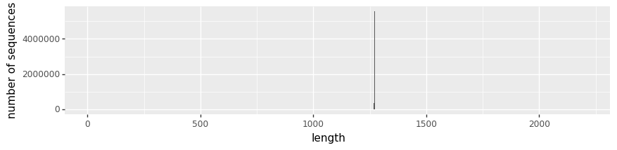
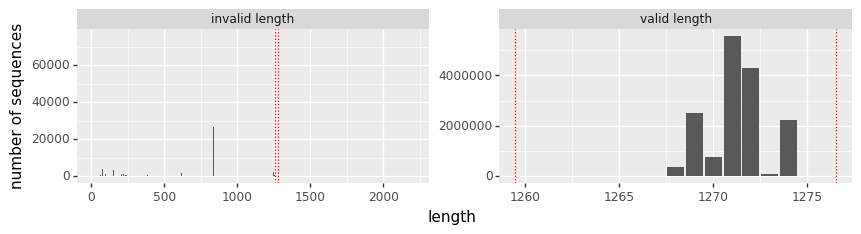

# Align spike sequences in GISAID and count RBD mutations
This Python Jupyter notebook reads in a file of all spike sequences from GISAID, parses for "high-quality" sequences, builds a RBD alignment, and then makes a file that gives the counts of each mutation at each site.

## Set up analysis
Import Python modules:


```python
import io
import lzma
import os
import re
import subprocess
import tarfile

from Bio.Data.IUPACData import protein_letters
import Bio.SeqIO

from IPython.display import display, HTML

import matplotlib.pyplot as plt

import pandas as pd

from plotnine import *

import yaml
```

Read the configuration file:


```python
with open('config.yaml') as f:
    config = yaml.safe_load(f)
```

Create output directory:


```python
os.makedirs(config['gisaid_mutations_dir'], exist_ok=True)
```

## Parse full-length human human spike sequences

Read the spikes from the file downloaded from GISAID:


```python
# Specify the name of the file within the tar
file_name = "spikeprot1112/spikeprot1112.fasta"

# Open the compressed file as a tar archive
with tarfile.open(config['gisaid_spikes'], "r:xz") as tar:
    # Extract the specific file from the tar archive
    file_in_tar = tar.extractfile(file_name)
    # Wrap the file_in_tar object with TextIOWrapper to open it in text mode
    file_in_tar_text = io.TextIOWrapper(file_in_tar, encoding='latin1')
    # Open the wrapped file using Bio.SeqIO.parse
    spikes = list(Bio.SeqIO.parse(file_in_tar_text, 'fasta'))

print(f"Read {len(spikes)} spike sequences.")
```

    Read 16238458 spike sequences.


Make a data frame that has the BioPython SeqRecord, length, host, and geographic location (country) for each spike.
Also determine whether sequences have ambiguous amino acids or are all valid amino acids:


```python
spikes_df = (
    pd.DataFrame({'seqrecord': spikes})
    .assign(description=lambda x: x['seqrecord'].map(lambda rec: rec.description),
            country=lambda x: x['description'].str.split('|').str[-1],
            host=lambda x: x['description'].str.split('|').str[6].str.strip(),
            length=lambda x: x['seqrecord'].map(len),
            n_ambiguous=lambda x: x['seqrecord'].map(lambda rec: rec.seq.count('X') + rec.seq.count('x')),
            )
    )
```

Show number of sequences from different hosts, then keep only human ones:


```python
display(HTML(
    spikes_df
    .groupby('host')
    .aggregate(n_sequences=pd.NamedAgg('seqrecord', 'count'))
    .sort_values('n_sequences', ascending=False)
    .to_html()
    ))

spikes_df = spikes_df.query('host == "Human"')
```


<table border="1" class="dataframe">
  <thead>
    <tr style="text-align: right;">
      <th></th>
      <th>n_sequences</th>
    </tr>
    <tr>
      <th>host</th>
      <th></th>
    </tr>
  </thead>
  <tbody>
    <tr>
      <th>Human</th>
      <td>16221151</td>
    </tr>
    <tr>
      <th>Environment</th>
      <td>12356</td>
    </tr>
    <tr>
      <th>Neovison vison</th>
      <td>1296</td>
    </tr>
    <tr>
      <th>Environmental</th>
      <td>796</td>
    </tr>
    <tr>
      <th>Odocoileus virginianus</th>
      <td>596</td>
    </tr>
    <tr>
      <th>unknown</th>
      <td>196</td>
    </tr>
    <tr>
      <th>Felis catus</th>
      <td>174</td>
    </tr>
    <tr>
      <th>Canis lupus familiaris</th>
      <td>108</td>
    </tr>
    <tr>
      <th>Panthera leo</th>
      <td>77</td>
    </tr>
    <tr>
      <th>Humano</th>
      <td>76</td>
    </tr>
    <tr>
      <th>Hunan</th>
      <td>66</td>
    </tr>
    <tr>
      <th>Mus musculus</th>
      <td>62</td>
    </tr>
    <tr>
      <th>Neogale vison</th>
      <td>51</td>
    </tr>
    <tr>
      <th>Mesocricetus auratus</th>
      <td>33</td>
    </tr>
    <tr>
      <th>Cellculture</th>
      <td>32</td>
    </tr>
    <tr>
      <th>Laboratory derived</th>
      <td>30</td>
    </tr>
    <tr>
      <th>Neovision vision</th>
      <td>23</td>
    </tr>
    <tr>
      <th>Mustela lutreola</th>
      <td>23</td>
    </tr>
    <tr>
      <th>Panthera tigris</th>
      <td>23</td>
    </tr>
    <tr>
      <th>Foreing</th>
      <td>20</td>
    </tr>
    <tr>
      <th>Mouse</th>
      <td>20</td>
    </tr>
    <tr>
      <th>Manis javanica</th>
      <td>20</td>
    </tr>
    <tr>
      <th>canis lupus</th>
      <td>14</td>
    </tr>
    <tr>
      <th>Panthera tigris jacksoni</th>
      <td>13</td>
    </tr>
    <tr>
      <th>Gorilla gorilla</th>
      <td>11</td>
    </tr>
    <tr>
      <th>Neovision vison</th>
      <td>11</td>
    </tr>
    <tr>
      <th>Panthera uncia</th>
      <td>10</td>
    </tr>
    <tr>
      <th>Aonyx cinereus</th>
      <td>8</td>
    </tr>
    <tr>
      <th>Cat</th>
      <td>7</td>
    </tr>
    <tr>
      <th>Rhinolophus malayanus</th>
      <td>7</td>
    </tr>
    <tr>
      <th>Panthera tigris tigris</th>
      <td>6</td>
    </tr>
    <tr>
      <th>Human male</th>
      <td>5</td>
    </tr>
    <tr>
      <th>P1 culture</th>
      <td>5</td>
    </tr>
    <tr>
      <th>Dog</th>
      <td>4</td>
    </tr>
    <tr>
      <th>Rhinolophus pusillus</th>
      <td>3</td>
    </tr>
    <tr>
      <th>Passaged Outgrowth</th>
      <td>3</td>
    </tr>
    <tr>
      <th>mus musculus</th>
      <td>3</td>
    </tr>
    <tr>
      <th>P2 culture</th>
      <td>3</td>
    </tr>
    <tr>
      <th>African Green Monkey</th>
      <td>3</td>
    </tr>
    <tr>
      <th>Gorilla</th>
      <td>3</td>
    </tr>
    <tr>
      <th>Chaetophractus villosus</th>
      <td>3</td>
    </tr>
    <tr>
      <th>Control</th>
      <td>3</td>
    </tr>
    <tr>
      <th>Human female</th>
      <td>3</td>
    </tr>
    <tr>
      <th>Environment (Restaurant)</th>
      <td>3</td>
    </tr>
    <tr>
      <th>Gorilla gorilla gorilla</th>
      <td>3</td>
    </tr>
    <tr>
      <th>Snow Leopard</th>
      <td>2</td>
    </tr>
    <tr>
      <th>Rhinolophus shameli</th>
      <td>2</td>
    </tr>
    <tr>
      <th>Cultured cells</th>
      <td>2</td>
    </tr>
    <tr>
      <th>Panthera tigris sondaica</th>
      <td>2</td>
    </tr>
    <tr>
      <th>Cygnus columbianus</th>
      <td>2</td>
    </tr>
    <tr>
      <th>Rhinolophus stheno</th>
      <td>2</td>
    </tr>
    <tr>
      <th>Mustela putorius furo</th>
      <td>2</td>
    </tr>
    <tr>
      <th>Tadarida brasiliensis</th>
      <td>2</td>
    </tr>
    <tr>
      <th>Odocoileus hemionus</th>
      <td>2</td>
    </tr>
    <tr>
      <th>Tiger</th>
      <td>2</td>
    </tr>
    <tr>
      <th>White tailed deer</th>
      <td>2</td>
    </tr>
    <tr>
      <th>Hombre</th>
      <td>2</td>
    </tr>
    <tr>
      <th>Rhinolophus bat</th>
      <td>1</td>
    </tr>
    <tr>
      <th>Saimiri sciureus</th>
      <td>1</td>
    </tr>
    <tr>
      <th>Rhinolophus sinicus</th>
      <td>1</td>
    </tr>
    <tr>
      <th>Canis lupus</th>
      <td>1</td>
    </tr>
    <tr>
      <th>hCoV-19^^Louisiana</th>
      <td>1</td>
    </tr>
    <tr>
      <th>mink</th>
      <td>1</td>
    </tr>
    <tr>
      <th>Arctictis binturong</th>
      <td>1</td>
    </tr>
    <tr>
      <th>Rhinolophus marshalli</th>
      <td>1</td>
    </tr>
    <tr>
      <th>Chlorocebus sabaeus</th>
      <td>1</td>
    </tr>
    <tr>
      <th>Mus musculus (BALB/c mice)</th>
      <td>1</td>
    </tr>
    <tr>
      <th>Rhinolophus affinis</th>
      <td>1</td>
    </tr>
    <tr>
      <th>Otolemur garnettii</th>
      <td>1</td>
    </tr>
    <tr>
      <th>Mus Musculus</th>
      <td>1</td>
    </tr>
    <tr>
      <th>Manis pentadactyla</th>
      <td>1</td>
    </tr>
    <tr>
      <th>Nasua nasua</th>
      <td>1</td>
    </tr>
    <tr>
      <th>Lynx lynx familiaris</th>
      <td>1</td>
    </tr>
    <tr>
      <th>Hippopotamus amphibius</th>
      <td>1</td>
    </tr>
    <tr>
      <th>North America / USA / Louisiana / New Orleands</th>
      <td>1</td>
    </tr>
    <tr>
      <th>Foreign</th>
      <td>1</td>
    </tr>
    <tr>
      <th>Puma concolor</th>
      <td>1</td>
    </tr>
    <tr>
      <th>P3 culture</th>
      <td>1</td>
    </tr>
    <tr>
      <th>Panthera Leo</th>
      <td>1</td>
    </tr>
    <tr>
      <th>Felis Catus</th>
      <td>1</td>
    </tr>
    <tr>
      <th>Mustela furo</th>
      <td>1</td>
    </tr>
    <tr>
      <th>Prionailurus bengalensis euptilurus</th>
      <td>1</td>
    </tr>
    <tr>
      <th>Prionailurus viverrinus</th>
      <td>1</td>
    </tr>
    <tr>
      <th>Crocuta crocuta</th>
      <td>1</td>
    </tr>
  </tbody>
</table>


Plot distribution of lengths and only keep sequences that are full-length (or near full-length) spikes:


```python
print('Distribution of length for all spikes:')
p = (ggplot(spikes_df) +
     aes('length') +
     geom_bar() +
     ylab('number of sequences') +
     theme(figure_size=(10, 2))
     )
fig = p.draw()
display(fig)
plt.close(fig)

min_length, max_length = 1260, 1276
print(f"\nOnly keeping spikes with lengths between {min_length} and {max_length}")
spikes_df = (
    spikes_df
    .assign(valid_length=lambda x: (min_length <= x['length']) & (x['length'] <= max_length))
    )

print('Here are number of sequences with valid and invalid lengths:')
display(HTML(spikes_df
             .groupby('valid_length')
             .aggregate(n_sequences=pd.NamedAgg('seqrecord', 'count'))
             .to_html()
             ))

print('\nDistribution of lengths for sequences with valid and invalid lengths; '
      'dotted red lines delimit valid lengths:')
p = (ggplot(spikes_df
            .assign(valid_length=lambda x: x['valid_length'].map({True: 'valid length',
                                                                  False: 'invalid length'}))
            ) +
     aes('length') +
     geom_bar() +
     ylab('number of sequences') +
     theme(figure_size=(10, 2), subplots_adjust={'wspace': 0.2}) +
     facet_wrap('~ valid_length', scales='free') +
     geom_vline(xintercept=min_length - 0.5, color='red', linetype='dotted') +
     geom_vline(xintercept=max_length + 0.5, color='red', linetype='dotted')
     )
fig = p.draw()
display(fig)
plt.close(fig)

spikes_df = spikes_df.query('valid_length')
```

    Distribution of length for all spikes:


    

    


    
    Only keeping spikes with lengths between 1260 and 1276
    Here are number of sequences with valid and invalid lengths:


<table border="1" class="dataframe">
  <thead>
    <tr style="text-align: right;">
      <th></th>
      <th>n_sequences</th>
    </tr>
    <tr>
      <th>valid_length</th>
      <th></th>
    </tr>
  </thead>
  <tbody>
    <tr>
      <th>False</th>
      <td>408475</td>
    </tr>
    <tr>
      <th>True</th>
      <td>15812676</td>
    </tr>
  </tbody>
</table>


    
    Distribution of lengths for sequences with valid and invalid lengths; dotted red lines delimit valid lengths:


    

    


Finally, we get rid of spikes with ambiguous residues as they may hinder the alignment below.
We will then do more detailed filtering for ambiguous residues just in the RBD region after alignment (that latter part is a holdover from when max_ambiguous at the spike stage is >0, but we will keep the code for posterity):


```python
max_ambiguous = 0
print(f"Filtering sequences with > {max_ambiguous} ambiguous residues")
spikes_df = (
    spikes_df
    .assign(excess_ambiguous=lambda x: x['n_ambiguous'] > max_ambiguous)
    )
display(HTML(
    spikes_df
    .groupby('excess_ambiguous')
    .aggregate(n_sequences=pd.NamedAgg('seqrecord', 'count'))
    .to_html()
    ))


spikes_df = spikes_df.query('~excess_ambiguous')
```

    Filtering sequences with > 0 ambiguous residues


<table border="1" class="dataframe">
  <thead>
    <tr style="text-align: right;">
      <th></th>
      <th>n_sequences</th>
    </tr>
    <tr>
      <th>excess_ambiguous</th>
      <th></th>
    </tr>
  </thead>
  <tbody>
    <tr>
      <th>False</th>
      <td>9811651</td>
    </tr>
    <tr>
      <th>True</th>
      <td>6001025</td>
    </tr>
  </tbody>
</table>


## Align the RBD region of the spikes
We now align the RBD regions of the spikes.
We do this **before** we filter sequences with too many ambiguous residues so that we can do that filtering just on the RBD region.

We align with `mafft` using the `--addfragments` and `--keeplength` options (see [here](https://mafft.cbrc.jp/alignment/software/closelyrelatedviralgenomes.html) and [here](https://mafft.cbrc.jp/alignment/software/addsequences.html)) to align relative to a reference that is just the RBD; these options also clip the sequences relative to the reference.
Note that these options make sense if the following conditions are met:
  1. Sequences are all very similar.
  2. We are not worried about insertions.
For now, both of these appear to be true, but this choice should be kept in mind if there is a lot more divergence or insertions.

We align relative to the reference that is the wildtype sequence used for the experiments:


```python
print(f"Reading reference nucleotide sequence in {config['wildtype_sequence']}")
refseq = Bio.SeqIO.read(config['wildtype_sequence'], 'fasta')

refprotfile = os.path.join(config['gisaid_mutations_dir'], 'reference_RBD.fasta')
print(f"Writing protein translation of reference sequence to {refprotfile}")
refseq.seq = refseq.seq.translate()
_ = Bio.SeqIO.write(refseq, refprotfile, 'fasta')
```

    Reading reference nucleotide sequence in data/wildtype_sequence.fasta
    Writing protein translation of reference sequence to results/GISAID_mutations/reference_RBD.fasta


Write all the other spikes to a file:


```python
# spikes_file = os.path.join(config['gisaid_mutations_dir'],
#                            'human_full-length_spikes.fasta')
# print(f"Writing the spikes to {spikes_file}")
# _ = Bio.SeqIO.write(spikes_df['seqrecord'].tolist(), spikes_file, 'fasta')
```

Now make the alignment.
Note that we use multiple threads to speed things up, and also align the spikes in chunks.
The reason that we have to the chunkwise alignment is that some unclear `mafft` error was arising if we tried to align them all at once:


```python
chunksize = 50000

aligned_rbds = []

for i in range(0, len(spikes_df), chunksize):
    spikes_file = os.path.join(config['gisaid_mutations_dir'],
                               f"human_full-length_spikes_{i + 1}-to-{i + chunksize}.fasta")
    print(f"Writing spikes {i + 1} to {i + chunksize} to {spikes_file}")
    _ = Bio.SeqIO.write(spikes_df['seqrecord'].tolist()[i: i + chunksize], spikes_file, 'fasta')
    print('Now aligning these sequences...')
    cmds = ['mafft', '--auto', '--thread', str(config['max_cpus']),
            '--keeplength', '--addfragments', spikes_file, refprotfile]
    res = subprocess.run(cmds, capture_output=True)
    if res.returncode:
        raise RuntimeError(f"Error in alignment:\n{res.stderr}")
    else:
        print('Alignment complete.\n')
        with io.StringIO(res.stdout.decode('latin1')) as f:
            iseqs = list(Bio.SeqIO.parse(f, 'fasta'))
            # remove reference sequence, which should be first in file
            assert iseqs[0].seq == refseq.seq and iseqs[0].description == refseq.description
            iseqs = iseqs[1:]
            assert len(iseqs) == min(chunksize, len(spikes_df) - i)
            aligned_rbds += iseqs
            
assert len(aligned_rbds) == len(spikes_df)
```

    Writing spikes 1 to 50000 to results/GISAID_mutations/human_full-length_spikes_1-to-50000.fasta
    Now aligning these sequences...
    Alignment complete.
    
    Writing spikes 50001 to 100000 to results/GISAID_mutations/human_full-length_spikes_50001-to-100000.fasta
    Now aligning these sequences...
    Alignment complete.
    
    Writing spikes 100001 to 150000 to results/GISAID_mutations/human_full-length_spikes_100001-to-150000.fasta
    Now aligning these sequences...
    Alignment complete.
    
    Writing spikes 150001 to 200000 to results/GISAID_mutations/human_full-length_spikes_150001-to-200000.fasta
    Now aligning these sequences...
    Alignment complete.
    
    Writing spikes 200001 to 250000 to results/GISAID_mutations/human_full-length_spikes_200001-to-250000.fasta
    Now aligning these sequences...
    Alignment complete.
    
    Writing spikes 250001 to 300000 to results/GISAID_mutations/human_full-length_spikes_250001-to-300000.fasta
    Now aligning these sequences...
    Alignment complete.
    
    Writing spikes 300001 to 350000 to results/GISAID_mutations/human_full-length_spikes_300001-to-350000.fasta
    Now aligning these sequences...
    Alignment complete.
    
    Writing spikes 350001 to 400000 to results/GISAID_mutations/human_full-length_spikes_350001-to-400000.fasta
    Now aligning these sequences...
    Alignment complete.
    
    Writing spikes 400001 to 450000 to results/GISAID_mutations/human_full-length_spikes_400001-to-450000.fasta
    Now aligning these sequences...
    Alignment complete.
    
    Writing spikes 450001 to 500000 to results/GISAID_mutations/human_full-length_spikes_450001-to-500000.fasta
    Now aligning these sequences...
    Alignment complete.
    
    Writing spikes 500001 to 550000 to results/GISAID_mutations/human_full-length_spikes_500001-to-550000.fasta
    Now aligning these sequences...
    Alignment complete.
    
    Writing spikes 550001 to 600000 to results/GISAID_mutations/human_full-length_spikes_550001-to-600000.fasta
    Now aligning these sequences...
    Alignment complete.
    
    Writing spikes 600001 to 650000 to results/GISAID_mutations/human_full-length_spikes_600001-to-650000.fasta
    Now aligning these sequences...
    Alignment complete.
    
    Writing spikes 650001 to 700000 to results/GISAID_mutations/human_full-length_spikes_650001-to-700000.fasta
    Now aligning these sequences...
    Alignment complete.
    
    Writing spikes 700001 to 750000 to results/GISAID_mutations/human_full-length_spikes_700001-to-750000.fasta
    Now aligning these sequences...
    Alignment complete.
    
    Writing spikes 750001 to 800000 to results/GISAID_mutations/human_full-length_spikes_750001-to-800000.fasta
    Now aligning these sequences...
    Alignment complete.
    
    Writing spikes 800001 to 850000 to results/GISAID_mutations/human_full-length_spikes_800001-to-850000.fasta
    Now aligning these sequences...
    Alignment complete.
    
    Writing spikes 850001 to 900000 to results/GISAID_mutations/human_full-length_spikes_850001-to-900000.fasta
    Now aligning these sequences...
    Alignment complete.
    
    Writing spikes 900001 to 950000 to results/GISAID_mutations/human_full-length_spikes_900001-to-950000.fasta
    Now aligning these sequences...
    Alignment complete.
    
    Writing spikes 950001 to 1000000 to results/GISAID_mutations/human_full-length_spikes_950001-to-1000000.fasta
    Now aligning these sequences...
    Alignment complete.
    
    Writing spikes 1000001 to 1050000 to results/GISAID_mutations/human_full-length_spikes_1000001-to-1050000.fasta
    Now aligning these sequences...
    Alignment complete.
    
    Writing spikes 1050001 to 1100000 to results/GISAID_mutations/human_full-length_spikes_1050001-to-1100000.fasta
    Now aligning these sequences...
    Alignment complete.
    
    Writing spikes 1100001 to 1150000 to results/GISAID_mutations/human_full-length_spikes_1100001-to-1150000.fasta
    Now aligning these sequences...
    Alignment complete.
    
    Writing spikes 1150001 to 1200000 to results/GISAID_mutations/human_full-length_spikes_1150001-to-1200000.fasta
    Now aligning these sequences...
    Alignment complete.
    
    Writing spikes 1200001 to 1250000 to results/GISAID_mutations/human_full-length_spikes_1200001-to-1250000.fasta
    Now aligning these sequences...
    Alignment complete.
    
    Writing spikes 1250001 to 1300000 to results/GISAID_mutations/human_full-length_spikes_1250001-to-1300000.fasta
    Now aligning these sequences...
    Alignment complete.
    
    Writing spikes 1300001 to 1350000 to results/GISAID_mutations/human_full-length_spikes_1300001-to-1350000.fasta
    Now aligning these sequences...
    Alignment complete.
    
    Writing spikes 1350001 to 1400000 to results/GISAID_mutations/human_full-length_spikes_1350001-to-1400000.fasta
    Now aligning these sequences...
    Alignment complete.
    
    Writing spikes 1400001 to 1450000 to results/GISAID_mutations/human_full-length_spikes_1400001-to-1450000.fasta
    Now aligning these sequences...
    Alignment complete.
    
    Writing spikes 1450001 to 1500000 to results/GISAID_mutations/human_full-length_spikes_1450001-to-1500000.fasta
    Now aligning these sequences...
    Alignment complete.
    
    Writing spikes 1500001 to 1550000 to results/GISAID_mutations/human_full-length_spikes_1500001-to-1550000.fasta
    Now aligning these sequences...
    Alignment complete.
    
    Writing spikes 1550001 to 1600000 to results/GISAID_mutations/human_full-length_spikes_1550001-to-1600000.fasta
    Now aligning these sequences...
    Alignment complete.
    
    Writing spikes 1600001 to 1650000 to results/GISAID_mutations/human_full-length_spikes_1600001-to-1650000.fasta
    Now aligning these sequences...
    Alignment complete.
    
    Writing spikes 1650001 to 1700000 to results/GISAID_mutations/human_full-length_spikes_1650001-to-1700000.fasta
    Now aligning these sequences...
    Alignment complete.
    
    Writing spikes 1700001 to 1750000 to results/GISAID_mutations/human_full-length_spikes_1700001-to-1750000.fasta
    Now aligning these sequences...
    Alignment complete.
    
    Writing spikes 1750001 to 1800000 to results/GISAID_mutations/human_full-length_spikes_1750001-to-1800000.fasta
    Now aligning these sequences...
    Alignment complete.
    
    Writing spikes 1800001 to 1850000 to results/GISAID_mutations/human_full-length_spikes_1800001-to-1850000.fasta
    Now aligning these sequences...
    Alignment complete.
    
    Writing spikes 1850001 to 1900000 to results/GISAID_mutations/human_full-length_spikes_1850001-to-1900000.fasta
    Now aligning these sequences...
    Alignment complete.
    
    Writing spikes 1900001 to 1950000 to results/GISAID_mutations/human_full-length_spikes_1900001-to-1950000.fasta
    Now aligning these sequences...
    Alignment complete.
    
    Writing spikes 1950001 to 2000000 to results/GISAID_mutations/human_full-length_spikes_1950001-to-2000000.fasta
    Now aligning these sequences...
    Alignment complete.
    
    Writing spikes 2000001 to 2050000 to results/GISAID_mutations/human_full-length_spikes_2000001-to-2050000.fasta
    Now aligning these sequences...
    Alignment complete.
    
    Writing spikes 2050001 to 2100000 to results/GISAID_mutations/human_full-length_spikes_2050001-to-2100000.fasta
    Now aligning these sequences...
    Alignment complete.
    
    Writing spikes 2100001 to 2150000 to results/GISAID_mutations/human_full-length_spikes_2100001-to-2150000.fasta
    Now aligning these sequences...
    Alignment complete.
    
    Writing spikes 2150001 to 2200000 to results/GISAID_mutations/human_full-length_spikes_2150001-to-2200000.fasta
    Now aligning these sequences...
    Alignment complete.
    
    Writing spikes 2200001 to 2250000 to results/GISAID_mutations/human_full-length_spikes_2200001-to-2250000.fasta
    Now aligning these sequences...
    Alignment complete.
    
    Writing spikes 2250001 to 2300000 to results/GISAID_mutations/human_full-length_spikes_2250001-to-2300000.fasta
    Now aligning these sequences...
    Alignment complete.
    
    Writing spikes 2300001 to 2350000 to results/GISAID_mutations/human_full-length_spikes_2300001-to-2350000.fasta
    Now aligning these sequences...
    Alignment complete.
    
    Writing spikes 2350001 to 2400000 to results/GISAID_mutations/human_full-length_spikes_2350001-to-2400000.fasta
    Now aligning these sequences...
    Alignment complete.
    
    Writing spikes 2400001 to 2450000 to results/GISAID_mutations/human_full-length_spikes_2400001-to-2450000.fasta
    Now aligning these sequences...
    Alignment complete.
    
    Writing spikes 2450001 to 2500000 to results/GISAID_mutations/human_full-length_spikes_2450001-to-2500000.fasta
    Now aligning these sequences...
    Alignment complete.
    
    Writing spikes 2500001 to 2550000 to results/GISAID_mutations/human_full-length_spikes_2500001-to-2550000.fasta
    Now aligning these sequences...
    Alignment complete.
    
    Writing spikes 2550001 to 2600000 to results/GISAID_mutations/human_full-length_spikes_2550001-to-2600000.fasta
    Now aligning these sequences...
    Alignment complete.
    
    Writing spikes 2600001 to 2650000 to results/GISAID_mutations/human_full-length_spikes_2600001-to-2650000.fasta
    Now aligning these sequences...
    Alignment complete.
    
    Writing spikes 2650001 to 2700000 to results/GISAID_mutations/human_full-length_spikes_2650001-to-2700000.fasta
    Now aligning these sequences...
    Alignment complete.
    
    Writing spikes 2700001 to 2750000 to results/GISAID_mutations/human_full-length_spikes_2700001-to-2750000.fasta
    Now aligning these sequences...
    Alignment complete.
    
    Writing spikes 2750001 to 2800000 to results/GISAID_mutations/human_full-length_spikes_2750001-to-2800000.fasta
    Now aligning these sequences...
    Alignment complete.
    
    Writing spikes 2800001 to 2850000 to results/GISAID_mutations/human_full-length_spikes_2800001-to-2850000.fasta
    Now aligning these sequences...
    Alignment complete.
    
    Writing spikes 2850001 to 2900000 to results/GISAID_mutations/human_full-length_spikes_2850001-to-2900000.fasta
    Now aligning these sequences...
    Alignment complete.
    
    Writing spikes 2900001 to 2950000 to results/GISAID_mutations/human_full-length_spikes_2900001-to-2950000.fasta
    Now aligning these sequences...
    Alignment complete.
    
    Writing spikes 2950001 to 3000000 to results/GISAID_mutations/human_full-length_spikes_2950001-to-3000000.fasta
    Now aligning these sequences...
    Alignment complete.
    
    Writing spikes 3000001 to 3050000 to results/GISAID_mutations/human_full-length_spikes_3000001-to-3050000.fasta
    Now aligning these sequences...
    Alignment complete.
    
    Writing spikes 3050001 to 3100000 to results/GISAID_mutations/human_full-length_spikes_3050001-to-3100000.fasta
    Now aligning these sequences...
    Alignment complete.
    
    Writing spikes 3100001 to 3150000 to results/GISAID_mutations/human_full-length_spikes_3100001-to-3150000.fasta
    Now aligning these sequences...
    Alignment complete.
    
    Writing spikes 3150001 to 3200000 to results/GISAID_mutations/human_full-length_spikes_3150001-to-3200000.fasta
    Now aligning these sequences...
    Alignment complete.
    
    Writing spikes 3200001 to 3250000 to results/GISAID_mutations/human_full-length_spikes_3200001-to-3250000.fasta
    Now aligning these sequences...
    Alignment complete.
    
    Writing spikes 3250001 to 3300000 to results/GISAID_mutations/human_full-length_spikes_3250001-to-3300000.fasta
    Now aligning these sequences...
    Alignment complete.
    
    Writing spikes 3300001 to 3350000 to results/GISAID_mutations/human_full-length_spikes_3300001-to-3350000.fasta
    Now aligning these sequences...
    Alignment complete.
    
    Writing spikes 3350001 to 3400000 to results/GISAID_mutations/human_full-length_spikes_3350001-to-3400000.fasta
    Now aligning these sequences...
    Alignment complete.
    
    Writing spikes 3400001 to 3450000 to results/GISAID_mutations/human_full-length_spikes_3400001-to-3450000.fasta
    Now aligning these sequences...
    Alignment complete.
    
    Writing spikes 3450001 to 3500000 to results/GISAID_mutations/human_full-length_spikes_3450001-to-3500000.fasta
    Now aligning these sequences...
    Alignment complete.
    
    Writing spikes 3500001 to 3550000 to results/GISAID_mutations/human_full-length_spikes_3500001-to-3550000.fasta
    Now aligning these sequences...
    Alignment complete.
    
    Writing spikes 3550001 to 3600000 to results/GISAID_mutations/human_full-length_spikes_3550001-to-3600000.fasta
    Now aligning these sequences...
    Alignment complete.
    
    Writing spikes 3600001 to 3650000 to results/GISAID_mutations/human_full-length_spikes_3600001-to-3650000.fasta
    Now aligning these sequences...
    Alignment complete.
    
    Writing spikes 3650001 to 3700000 to results/GISAID_mutations/human_full-length_spikes_3650001-to-3700000.fasta
    Now aligning these sequences...
    Alignment complete.
    
    Writing spikes 3700001 to 3750000 to results/GISAID_mutations/human_full-length_spikes_3700001-to-3750000.fasta
    Now aligning these sequences...
    Alignment complete.
    
    Writing spikes 3750001 to 3800000 to results/GISAID_mutations/human_full-length_spikes_3750001-to-3800000.fasta
    Now aligning these sequences...
    Alignment complete.
    
    Writing spikes 3800001 to 3850000 to results/GISAID_mutations/human_full-length_spikes_3800001-to-3850000.fasta
    Now aligning these sequences...
    Alignment complete.
    
    Writing spikes 3850001 to 3900000 to results/GISAID_mutations/human_full-length_spikes_3850001-to-3900000.fasta
    Now aligning these sequences...
    Alignment complete.
    
    Writing spikes 3900001 to 3950000 to results/GISAID_mutations/human_full-length_spikes_3900001-to-3950000.fasta
    Now aligning these sequences...
    Alignment complete.
    
    Writing spikes 3950001 to 4000000 to results/GISAID_mutations/human_full-length_spikes_3950001-to-4000000.fasta
    Now aligning these sequences...
    Alignment complete.
    
    Writing spikes 4000001 to 4050000 to results/GISAID_mutations/human_full-length_spikes_4000001-to-4050000.fasta
    Now aligning these sequences...
    Alignment complete.
    
    Writing spikes 4050001 to 4100000 to results/GISAID_mutations/human_full-length_spikes_4050001-to-4100000.fasta
    Now aligning these sequences...
    Alignment complete.
    
    Writing spikes 4100001 to 4150000 to results/GISAID_mutations/human_full-length_spikes_4100001-to-4150000.fasta
    Now aligning these sequences...
    Alignment complete.
    
    Writing spikes 4150001 to 4200000 to results/GISAID_mutations/human_full-length_spikes_4150001-to-4200000.fasta
    Now aligning these sequences...
    Alignment complete.
    
    Writing spikes 4200001 to 4250000 to results/GISAID_mutations/human_full-length_spikes_4200001-to-4250000.fasta
    Now aligning these sequences...
    Alignment complete.
    
    Writing spikes 4250001 to 4300000 to results/GISAID_mutations/human_full-length_spikes_4250001-to-4300000.fasta
    Now aligning these sequences...
    Alignment complete.
    
    Writing spikes 4300001 to 4350000 to results/GISAID_mutations/human_full-length_spikes_4300001-to-4350000.fasta
    Now aligning these sequences...
    Alignment complete.
    
    Writing spikes 4350001 to 4400000 to results/GISAID_mutations/human_full-length_spikes_4350001-to-4400000.fasta
    Now aligning these sequences...
    Alignment complete.
    
    Writing spikes 4400001 to 4450000 to results/GISAID_mutations/human_full-length_spikes_4400001-to-4450000.fasta
    Now aligning these sequences...
    Alignment complete.
    
    Writing spikes 4450001 to 4500000 to results/GISAID_mutations/human_full-length_spikes_4450001-to-4500000.fasta
    Now aligning these sequences...
    Alignment complete.
    
    Writing spikes 4500001 to 4550000 to results/GISAID_mutations/human_full-length_spikes_4500001-to-4550000.fasta
    Now aligning these sequences...
    Alignment complete.
    
    Writing spikes 4550001 to 4600000 to results/GISAID_mutations/human_full-length_spikes_4550001-to-4600000.fasta
    Now aligning these sequences...
    Alignment complete.
    
    Writing spikes 4600001 to 4650000 to results/GISAID_mutations/human_full-length_spikes_4600001-to-4650000.fasta
    Now aligning these sequences...
    Alignment complete.
    
    Writing spikes 4650001 to 4700000 to results/GISAID_mutations/human_full-length_spikes_4650001-to-4700000.fasta
    Now aligning these sequences...
    Alignment complete.
    
    Writing spikes 4700001 to 4750000 to results/GISAID_mutations/human_full-length_spikes_4700001-to-4750000.fasta
    Now aligning these sequences...
    Alignment complete.
    
    Writing spikes 4750001 to 4800000 to results/GISAID_mutations/human_full-length_spikes_4750001-to-4800000.fasta
    Now aligning these sequences...
    Alignment complete.
    
    Writing spikes 4800001 to 4850000 to results/GISAID_mutations/human_full-length_spikes_4800001-to-4850000.fasta
    Now aligning these sequences...
    Alignment complete.
    
    Writing spikes 4850001 to 4900000 to results/GISAID_mutations/human_full-length_spikes_4850001-to-4900000.fasta
    Now aligning these sequences...
    Alignment complete.
    
    Writing spikes 4900001 to 4950000 to results/GISAID_mutations/human_full-length_spikes_4900001-to-4950000.fasta
    Now aligning these sequences...
    Alignment complete.
    
    Writing spikes 4950001 to 5000000 to results/GISAID_mutations/human_full-length_spikes_4950001-to-5000000.fasta
    Now aligning these sequences...
    Alignment complete.
    
    Writing spikes 5000001 to 5050000 to results/GISAID_mutations/human_full-length_spikes_5000001-to-5050000.fasta
    Now aligning these sequences...
    Alignment complete.
    
    Writing spikes 5050001 to 5100000 to results/GISAID_mutations/human_full-length_spikes_5050001-to-5100000.fasta
    Now aligning these sequences...
    Alignment complete.
    
    Writing spikes 5100001 to 5150000 to results/GISAID_mutations/human_full-length_spikes_5100001-to-5150000.fasta
    Now aligning these sequences...
    Alignment complete.
    
    Writing spikes 5150001 to 5200000 to results/GISAID_mutations/human_full-length_spikes_5150001-to-5200000.fasta
    Now aligning these sequences...
    Alignment complete.
    
    Writing spikes 5200001 to 5250000 to results/GISAID_mutations/human_full-length_spikes_5200001-to-5250000.fasta
    Now aligning these sequences...
    Alignment complete.
    
    Writing spikes 5250001 to 5300000 to results/GISAID_mutations/human_full-length_spikes_5250001-to-5300000.fasta
    Now aligning these sequences...
    Alignment complete.
    
    Writing spikes 5300001 to 5350000 to results/GISAID_mutations/human_full-length_spikes_5300001-to-5350000.fasta
    Now aligning these sequences...
    Alignment complete.
    
    Writing spikes 5350001 to 5400000 to results/GISAID_mutations/human_full-length_spikes_5350001-to-5400000.fasta
    Now aligning these sequences...
    Alignment complete.
    
    Writing spikes 5400001 to 5450000 to results/GISAID_mutations/human_full-length_spikes_5400001-to-5450000.fasta
    Now aligning these sequences...
    Alignment complete.
    
    Writing spikes 5450001 to 5500000 to results/GISAID_mutations/human_full-length_spikes_5450001-to-5500000.fasta
    Now aligning these sequences...
    Alignment complete.
    
    Writing spikes 5500001 to 5550000 to results/GISAID_mutations/human_full-length_spikes_5500001-to-5550000.fasta
    Now aligning these sequences...
    Alignment complete.
    
    Writing spikes 5550001 to 5600000 to results/GISAID_mutations/human_full-length_spikes_5550001-to-5600000.fasta
    Now aligning these sequences...
    Alignment complete.
    
    Writing spikes 5600001 to 5650000 to results/GISAID_mutations/human_full-length_spikes_5600001-to-5650000.fasta
    Now aligning these sequences...
    Alignment complete.
    
    Writing spikes 5650001 to 5700000 to results/GISAID_mutations/human_full-length_spikes_5650001-to-5700000.fasta
    Now aligning these sequences...
    Alignment complete.
    
    Writing spikes 5700001 to 5750000 to results/GISAID_mutations/human_full-length_spikes_5700001-to-5750000.fasta
    Now aligning these sequences...
    Alignment complete.
    
    Writing spikes 5750001 to 5800000 to results/GISAID_mutations/human_full-length_spikes_5750001-to-5800000.fasta
    Now aligning these sequences...
    Alignment complete.
    
    Writing spikes 5800001 to 5850000 to results/GISAID_mutations/human_full-length_spikes_5800001-to-5850000.fasta
    Now aligning these sequences...
    Alignment complete.
    
    Writing spikes 5850001 to 5900000 to results/GISAID_mutations/human_full-length_spikes_5850001-to-5900000.fasta
    Now aligning these sequences...
    Alignment complete.
    
    Writing spikes 5900001 to 5950000 to results/GISAID_mutations/human_full-length_spikes_5900001-to-5950000.fasta
    Now aligning these sequences...
    Alignment complete.
    
    Writing spikes 5950001 to 6000000 to results/GISAID_mutations/human_full-length_spikes_5950001-to-6000000.fasta
    Now aligning these sequences...
    Alignment complete.
    
    Writing spikes 6000001 to 6050000 to results/GISAID_mutations/human_full-length_spikes_6000001-to-6050000.fasta
    Now aligning these sequences...
    Alignment complete.
    
    Writing spikes 6050001 to 6100000 to results/GISAID_mutations/human_full-length_spikes_6050001-to-6100000.fasta
    Now aligning these sequences...
    Alignment complete.
    
    Writing spikes 6100001 to 6150000 to results/GISAID_mutations/human_full-length_spikes_6100001-to-6150000.fasta
    Now aligning these sequences...
    Alignment complete.
    
    Writing spikes 6150001 to 6200000 to results/GISAID_mutations/human_full-length_spikes_6150001-to-6200000.fasta
    Now aligning these sequences...
    Alignment complete.
    
    Writing spikes 6200001 to 6250000 to results/GISAID_mutations/human_full-length_spikes_6200001-to-6250000.fasta
    Now aligning these sequences...
    Alignment complete.
    
    Writing spikes 6250001 to 6300000 to results/GISAID_mutations/human_full-length_spikes_6250001-to-6300000.fasta
    Now aligning these sequences...
    Alignment complete.
    
    Writing spikes 6300001 to 6350000 to results/GISAID_mutations/human_full-length_spikes_6300001-to-6350000.fasta
    Now aligning these sequences...
    Alignment complete.
    
    Writing spikes 6350001 to 6400000 to results/GISAID_mutations/human_full-length_spikes_6350001-to-6400000.fasta
    Now aligning these sequences...
    Alignment complete.
    
    Writing spikes 6400001 to 6450000 to results/GISAID_mutations/human_full-length_spikes_6400001-to-6450000.fasta
    Now aligning these sequences...
    Alignment complete.
    
    Writing spikes 6450001 to 6500000 to results/GISAID_mutations/human_full-length_spikes_6450001-to-6500000.fasta
    Now aligning these sequences...
    Alignment complete.
    
    Writing spikes 6500001 to 6550000 to results/GISAID_mutations/human_full-length_spikes_6500001-to-6550000.fasta
    Now aligning these sequences...
    Alignment complete.
    
    Writing spikes 6550001 to 6600000 to results/GISAID_mutations/human_full-length_spikes_6550001-to-6600000.fasta
    Now aligning these sequences...
    Alignment complete.
    
    Writing spikes 6600001 to 6650000 to results/GISAID_mutations/human_full-length_spikes_6600001-to-6650000.fasta
    Now aligning these sequences...
    Alignment complete.
    
    Writing spikes 6650001 to 6700000 to results/GISAID_mutations/human_full-length_spikes_6650001-to-6700000.fasta
    Now aligning these sequences...
    Alignment complete.
    
    Writing spikes 6700001 to 6750000 to results/GISAID_mutations/human_full-length_spikes_6700001-to-6750000.fasta
    Now aligning these sequences...
    Alignment complete.
    
    Writing spikes 6750001 to 6800000 to results/GISAID_mutations/human_full-length_spikes_6750001-to-6800000.fasta
    Now aligning these sequences...
    Alignment complete.
    
    Writing spikes 6800001 to 6850000 to results/GISAID_mutations/human_full-length_spikes_6800001-to-6850000.fasta
    Now aligning these sequences...
    Alignment complete.
    
    Writing spikes 6850001 to 6900000 to results/GISAID_mutations/human_full-length_spikes_6850001-to-6900000.fasta
    Now aligning these sequences...
    Alignment complete.
    
    Writing spikes 6900001 to 6950000 to results/GISAID_mutations/human_full-length_spikes_6900001-to-6950000.fasta
    Now aligning these sequences...
    Alignment complete.
    
    Writing spikes 6950001 to 7000000 to results/GISAID_mutations/human_full-length_spikes_6950001-to-7000000.fasta
    Now aligning these sequences...
    Alignment complete.
    
    Writing spikes 7000001 to 7050000 to results/GISAID_mutations/human_full-length_spikes_7000001-to-7050000.fasta
    Now aligning these sequences...
    Alignment complete.
    
    Writing spikes 7050001 to 7100000 to results/GISAID_mutations/human_full-length_spikes_7050001-to-7100000.fasta
    Now aligning these sequences...
    Alignment complete.
    
    Writing spikes 7100001 to 7150000 to results/GISAID_mutations/human_full-length_spikes_7100001-to-7150000.fasta
    Now aligning these sequences...
    Alignment complete.
    
    Writing spikes 7150001 to 7200000 to results/GISAID_mutations/human_full-length_spikes_7150001-to-7200000.fasta
    Now aligning these sequences...
    Alignment complete.
    
    Writing spikes 7200001 to 7250000 to results/GISAID_mutations/human_full-length_spikes_7200001-to-7250000.fasta
    Now aligning these sequences...
    Alignment complete.
    
    Writing spikes 7250001 to 7300000 to results/GISAID_mutations/human_full-length_spikes_7250001-to-7300000.fasta
    Now aligning these sequences...
    Alignment complete.
    
    Writing spikes 7300001 to 7350000 to results/GISAID_mutations/human_full-length_spikes_7300001-to-7350000.fasta
    Now aligning these sequences...
    Alignment complete.
    
    Writing spikes 7350001 to 7400000 to results/GISAID_mutations/human_full-length_spikes_7350001-to-7400000.fasta
    Now aligning these sequences...
    Alignment complete.
    
    Writing spikes 7400001 to 7450000 to results/GISAID_mutations/human_full-length_spikes_7400001-to-7450000.fasta
    Now aligning these sequences...
    Alignment complete.
    
    Writing spikes 7450001 to 7500000 to results/GISAID_mutations/human_full-length_spikes_7450001-to-7500000.fasta
    Now aligning these sequences...
    Alignment complete.
    
    Writing spikes 7500001 to 7550000 to results/GISAID_mutations/human_full-length_spikes_7500001-to-7550000.fasta
    Now aligning these sequences...
    Alignment complete.
    
    Writing spikes 7550001 to 7600000 to results/GISAID_mutations/human_full-length_spikes_7550001-to-7600000.fasta
    Now aligning these sequences...
    Alignment complete.
    
    Writing spikes 7600001 to 7650000 to results/GISAID_mutations/human_full-length_spikes_7600001-to-7650000.fasta
    Now aligning these sequences...
    Alignment complete.
    
    Writing spikes 7650001 to 7700000 to results/GISAID_mutations/human_full-length_spikes_7650001-to-7700000.fasta
    Now aligning these sequences...
    Alignment complete.
    
    Writing spikes 7700001 to 7750000 to results/GISAID_mutations/human_full-length_spikes_7700001-to-7750000.fasta
    Now aligning these sequences...
    Alignment complete.
    
    Writing spikes 7750001 to 7800000 to results/GISAID_mutations/human_full-length_spikes_7750001-to-7800000.fasta
    Now aligning these sequences...
    Alignment complete.
    
    Writing spikes 7800001 to 7850000 to results/GISAID_mutations/human_full-length_spikes_7800001-to-7850000.fasta
    Now aligning these sequences...
    Alignment complete.
    
    Writing spikes 7850001 to 7900000 to results/GISAID_mutations/human_full-length_spikes_7850001-to-7900000.fasta
    Now aligning these sequences...
    Alignment complete.
    
    Writing spikes 7900001 to 7950000 to results/GISAID_mutations/human_full-length_spikes_7900001-to-7950000.fasta
    Now aligning these sequences...
    Alignment complete.
    
    Writing spikes 7950001 to 8000000 to results/GISAID_mutations/human_full-length_spikes_7950001-to-8000000.fasta
    Now aligning these sequences...
    Alignment complete.
    
    Writing spikes 8000001 to 8050000 to results/GISAID_mutations/human_full-length_spikes_8000001-to-8050000.fasta
    Now aligning these sequences...
    Alignment complete.
    
    Writing spikes 8050001 to 8100000 to results/GISAID_mutations/human_full-length_spikes_8050001-to-8100000.fasta
    Now aligning these sequences...
    Alignment complete.
    
    Writing spikes 8100001 to 8150000 to results/GISAID_mutations/human_full-length_spikes_8100001-to-8150000.fasta
    Now aligning these sequences...
    Alignment complete.
    
    Writing spikes 8150001 to 8200000 to results/GISAID_mutations/human_full-length_spikes_8150001-to-8200000.fasta
    Now aligning these sequences...
    Alignment complete.
    
    Writing spikes 8200001 to 8250000 to results/GISAID_mutations/human_full-length_spikes_8200001-to-8250000.fasta
    Now aligning these sequences...
    Alignment complete.
    
    Writing spikes 8250001 to 8300000 to results/GISAID_mutations/human_full-length_spikes_8250001-to-8300000.fasta
    Now aligning these sequences...
    Alignment complete.
    
    Writing spikes 8300001 to 8350000 to results/GISAID_mutations/human_full-length_spikes_8300001-to-8350000.fasta
    Now aligning these sequences...
    Alignment complete.
    
    Writing spikes 8350001 to 8400000 to results/GISAID_mutations/human_full-length_spikes_8350001-to-8400000.fasta
    Now aligning these sequences...
    Alignment complete.
    
    Writing spikes 8400001 to 8450000 to results/GISAID_mutations/human_full-length_spikes_8400001-to-8450000.fasta
    Now aligning these sequences...
    Alignment complete.
    
    Writing spikes 8450001 to 8500000 to results/GISAID_mutations/human_full-length_spikes_8450001-to-8500000.fasta
    Now aligning these sequences...
    Alignment complete.
    
    Writing spikes 8500001 to 8550000 to results/GISAID_mutations/human_full-length_spikes_8500001-to-8550000.fasta
    Now aligning these sequences...
    Alignment complete.
    
    Writing spikes 8550001 to 8600000 to results/GISAID_mutations/human_full-length_spikes_8550001-to-8600000.fasta
    Now aligning these sequences...
    Alignment complete.
    
    Writing spikes 8600001 to 8650000 to results/GISAID_mutations/human_full-length_spikes_8600001-to-8650000.fasta
    Now aligning these sequences...
    Alignment complete.
    
    Writing spikes 8650001 to 8700000 to results/GISAID_mutations/human_full-length_spikes_8650001-to-8700000.fasta
    Now aligning these sequences...
    Alignment complete.
    
    Writing spikes 8700001 to 8750000 to results/GISAID_mutations/human_full-length_spikes_8700001-to-8750000.fasta
    Now aligning these sequences...
    Alignment complete.
    
    Writing spikes 8750001 to 8800000 to results/GISAID_mutations/human_full-length_spikes_8750001-to-8800000.fasta
    Now aligning these sequences...
    Alignment complete.
    
    Writing spikes 8800001 to 8850000 to results/GISAID_mutations/human_full-length_spikes_8800001-to-8850000.fasta
    Now aligning these sequences...
    Alignment complete.
    
    Writing spikes 8850001 to 8900000 to results/GISAID_mutations/human_full-length_spikes_8850001-to-8900000.fasta
    Now aligning these sequences...
    Alignment complete.
    
    Writing spikes 8900001 to 8950000 to results/GISAID_mutations/human_full-length_spikes_8900001-to-8950000.fasta
    Now aligning these sequences...
    Alignment complete.
    
    Writing spikes 8950001 to 9000000 to results/GISAID_mutations/human_full-length_spikes_8950001-to-9000000.fasta
    Now aligning these sequences...
    Alignment complete.
    
    Writing spikes 9000001 to 9050000 to results/GISAID_mutations/human_full-length_spikes_9000001-to-9050000.fasta
    Now aligning these sequences...
    Alignment complete.
    
    Writing spikes 9050001 to 9100000 to results/GISAID_mutations/human_full-length_spikes_9050001-to-9100000.fasta
    Now aligning these sequences...
    Alignment complete.
    
    Writing spikes 9100001 to 9150000 to results/GISAID_mutations/human_full-length_spikes_9100001-to-9150000.fasta
    Now aligning these sequences...
    Alignment complete.
    
    Writing spikes 9150001 to 9200000 to results/GISAID_mutations/human_full-length_spikes_9150001-to-9200000.fasta
    Now aligning these sequences...
    Alignment complete.
    
    Writing spikes 9200001 to 9250000 to results/GISAID_mutations/human_full-length_spikes_9200001-to-9250000.fasta
    Now aligning these sequences...
    Alignment complete.
    
    Writing spikes 9250001 to 9300000 to results/GISAID_mutations/human_full-length_spikes_9250001-to-9300000.fasta
    Now aligning these sequences...
    Alignment complete.
    
    Writing spikes 9300001 to 9350000 to results/GISAID_mutations/human_full-length_spikes_9300001-to-9350000.fasta
    Now aligning these sequences...
    Alignment complete.
    
    Writing spikes 9350001 to 9400000 to results/GISAID_mutations/human_full-length_spikes_9350001-to-9400000.fasta
    Now aligning these sequences...
    Alignment complete.
    
    Writing spikes 9400001 to 9450000 to results/GISAID_mutations/human_full-length_spikes_9400001-to-9450000.fasta
    Now aligning these sequences...
    Alignment complete.
    
    Writing spikes 9450001 to 9500000 to results/GISAID_mutations/human_full-length_spikes_9450001-to-9500000.fasta
    Now aligning these sequences...
    Alignment complete.
    
    Writing spikes 9500001 to 9550000 to results/GISAID_mutations/human_full-length_spikes_9500001-to-9550000.fasta
    Now aligning these sequences...
    Alignment complete.
    
    Writing spikes 9550001 to 9600000 to results/GISAID_mutations/human_full-length_spikes_9550001-to-9600000.fasta
    Now aligning these sequences...
    Alignment complete.
    
    Writing spikes 9600001 to 9650000 to results/GISAID_mutations/human_full-length_spikes_9600001-to-9650000.fasta
    Now aligning these sequences...
    Alignment complete.
    
    Writing spikes 9650001 to 9700000 to results/GISAID_mutations/human_full-length_spikes_9650001-to-9700000.fasta
    Now aligning these sequences...
    Alignment complete.
    
    Writing spikes 9700001 to 9750000 to results/GISAID_mutations/human_full-length_spikes_9700001-to-9750000.fasta
    Now aligning these sequences...
    Alignment complete.
    
    Writing spikes 9750001 to 9800000 to results/GISAID_mutations/human_full-length_spikes_9750001-to-9800000.fasta
    Now aligning these sequences...
    Alignment complete.
    
    Writing spikes 9800001 to 9850000 to results/GISAID_mutations/human_full-length_spikes_9800001-to-9850000.fasta
    Now aligning these sequences...
    Alignment complete.
    


## Parse / filter aligned RBDs

Now put all of the aligned RBDs into a data frame to filter and parse:


```python
rbd_df = (
    pd.DataFrame({'seqrecord': aligned_rbds})
    .assign(description=lambda x: x['seqrecord'].map(lambda rec: rec.description),
            country=lambda x: x['description'].str.split('|').str[-1],
            host=lambda x: x['description'].str.split('|').str[6].str.strip(),
            length=lambda x: x['seqrecord'].map(len),
            n_ambiguous=lambda x: x['seqrecord'].map(lambda rec: rec.seq.count('X') + rec.seq.count('x')),
            n_gaps=lambda x: x['seqrecord'].map(lambda rec: rec.seq.count('-')),
            all_valid_aas=lambda x: x['seqrecord'].map(lambda rec: re.fullmatch(f"[{protein_letters}]+",
                                                                                str(rec.seq)) is not None),
            )
    )

assert all(rbd_df['length'] == len(refseq))
```

Plot number of gaps and ambiguous nucleotides among sequences:


```python
for prop in ['n_ambiguous', 'n_gaps']:
    p = (ggplot(rbd_df) +
         aes(prop) +
         ylab('number of sequences') +
         theme(figure_size=(10, 2.5)) +
         geom_bar()
         )
    _ = p.draw()
```

Based on above plots, we will retain just RBDs with no ambiguous amino acids and no more than 3 gaps (sequecnes with many deletions appear to be quite artefactual / nonsensical):


```python
rbd_df = rbd_df.query('n_ambiguous == 0').query('n_gaps < 2')
print(f"Retained {len(rbd_df)} RBDs.")
```

    Retained 9811285 RBDs.


Now get and plot the number of amino-acid mutations per RBD relative to the reference sequence, plotting on both a linear and log scale.
We then filter all RBDs that have more than some maximum number of mutations, based on the idea that ones that are extremely highly mutated probably are erroneous.
**Note that this maximum number of mutations will change over time, so should be re-assessed periodically by looking at below plots.**


```python
max_muts = 50

refseq_str = str(refseq.seq)
rbd_df = (
    rbd_df
    .assign(seq=lambda x: x['seqrecord'].map(lambda rec: str(rec.seq)),
            n_mutations=lambda x: x['seq'].map(lambda s: sum(x != y for x, y in zip(s, refseq_str))))
    )

p = (ggplot(rbd_df) +
     aes('n_mutations') +
     geom_bar() +
     theme(figure_size=(10, 2.5)) +
     geom_vline(xintercept=max_muts + 0.5, color='red', linetype='dotted')
     )
_ = p.draw()
_ = (p + scale_y_log10()).draw()

rbd_df = rbd_df.query('n_mutations <= @max_muts')
```

Write RBD sequences that pass filtering to a file:


```python
print(f"Overall, there are {len(rbd_df)} aligned RBDs that passed filters.")

rbd_alignment_file = os.path.join(config['gisaid_mutations_dir'], 'RBD_alignment.fasta')
print(f"Writing alignment to {rbd_alignment_file}")
_ = Bio.SeqIO.write(rbd_df['seqrecord'].tolist(), rbd_alignment_file, 'fasta')
```

    Overall, there are 9811285 aligned RBDs that passed filters.
    Writing alignment to results/GISAID_mutations/RBD_alignment.fasta


## Get counts of each mutation
Now we get a data frame that gives the count of each mutation at each site:


```python
records = []
for tup in rbd_df[['seq', 'country']].itertuples():
    for isite, (mut, wt) in enumerate(zip(tup.seq, refseq_str), start=1):
        if mut != wt:
            records.append((isite, isite + config['site_number_offset'], wt, mut, tup.country))
            
muts_df = (pd.DataFrame.from_records(records,
                                     columns=['isite', 'site', 'wildtype', 'mutant', 'country'])
           .groupby(['isite', 'site', 'wildtype', 'mutant'])
           .aggregate(count=pd.NamedAgg('country', 'count'),
                      n_countries=pd.NamedAgg('country', 'nunique'))
           .reset_index()
           .sort_values('count', ascending=False)
           .assign(frequency=lambda x: x['count'] / len(rbd_df))
           )

print('Here are first few lines of mutation counts data frame:')
display(HTML(muts_df.head(n=15).to_html(index=False)))
```

    Here are first few lines of mutation counts data frame:


<table border="1" class="dataframe">
  <thead>
    <tr style="text-align: right;">
      <th>isite</th>
      <th>site</th>
      <th>wildtype</th>
      <th>mutant</th>
      <th>count</th>
      <th>n_countries</th>
      <th>frequency</th>
    </tr>
  </thead>
  <tbody>
    <tr>
      <td>148</td>
      <td>478</td>
      <td>T</td>
      <td>K</td>
      <td>7741846</td>
      <td>1867</td>
      <td>0.789076</td>
    </tr>
    <tr>
      <td>171</td>
      <td>501</td>
      <td>N</td>
      <td>Y</td>
      <td>6033018</td>
      <td>2032</td>
      <td>0.614906</td>
    </tr>
    <tr>
      <td>147</td>
      <td>477</td>
      <td>S</td>
      <td>N</td>
      <td>5018434</td>
      <td>1610</td>
      <td>0.511496</td>
    </tr>
    <tr>
      <td>43</td>
      <td>373</td>
      <td>S</td>
      <td>P</td>
      <td>4961230</td>
      <td>1498</td>
      <td>0.505666</td>
    </tr>
    <tr>
      <td>45</td>
      <td>375</td>
      <td>S</td>
      <td>F</td>
      <td>4959500</td>
      <td>1491</td>
      <td>0.505489</td>
    </tr>
    <tr>
      <td>168</td>
      <td>498</td>
      <td>Q</td>
      <td>R</td>
      <td>4958896</td>
      <td>1490</td>
      <td>0.505428</td>
    </tr>
    <tr>
      <td>175</td>
      <td>505</td>
      <td>Y</td>
      <td>H</td>
      <td>4955885</td>
      <td>1495</td>
      <td>0.505121</td>
    </tr>
    <tr>
      <td>154</td>
      <td>484</td>
      <td>E</td>
      <td>A</td>
      <td>4948448</td>
      <td>1502</td>
      <td>0.504363</td>
    </tr>
    <tr>
      <td>87</td>
      <td>417</td>
      <td>K</td>
      <td>N</td>
      <td>4875965</td>
      <td>1542</td>
      <td>0.496975</td>
    </tr>
    <tr>
      <td>110</td>
      <td>440</td>
      <td>N</td>
      <td>K</td>
      <td>4831617</td>
      <td>1495</td>
      <td>0.492455</td>
    </tr>
    <tr>
      <td>122</td>
      <td>452</td>
      <td>L</td>
      <td>R</td>
      <td>4745171</td>
      <td>1564</td>
      <td>0.483644</td>
    </tr>
    <tr>
      <td>9</td>
      <td>339</td>
      <td>G</td>
      <td>D</td>
      <td>4407818</td>
      <td>1412</td>
      <td>0.449260</td>
    </tr>
    <tr>
      <td>46</td>
      <td>376</td>
      <td>T</td>
      <td>A</td>
      <td>3850176</td>
      <td>1267</td>
      <td>0.392423</td>
    </tr>
    <tr>
      <td>41</td>
      <td>371</td>
      <td>S</td>
      <td>F</td>
      <td>3847365</td>
      <td>1276</td>
      <td>0.392137</td>
    </tr>
    <tr>
      <td>75</td>
      <td>405</td>
      <td>D</td>
      <td>N</td>
      <td>3846457</td>
      <td>1273</td>
      <td>0.392044</td>
    </tr>
  </tbody>
</table>


Plot how many mutations are observed how many times:


```python
p = (ggplot(muts_df) +
     aes('count') +
     geom_histogram(bins=20) +
     scale_x_log10() +
     ylab('number of sequences') +
     xlab('times mutation observed')
     )

_ = p.draw()
```

Write the mutation counts to a file:


```python
print(f"Writing mutation counts to {config['gisaid_mutation_counts']}")
muts_df.to_csv(config['gisaid_mutation_counts'], index=False)
```

    Writing mutation counts to results/GISAID_mutations/mutation_counts.csv

