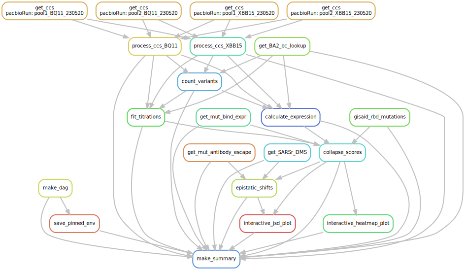

# Summary

Analysis run by [Snakefile](../../Snakefile)
using [this config file](../../config.yaml).
See the [README in the top directory](../../README.md)
for details.

Here is the DAG of the computational workflow:

Here is the Markdown output of each Jupyter notebook in the
workflow:

1. Get prior RBD DMS mutation-level binding and expression data and BA.2 barcode-variant lookup table from [prior DMS study](https://github.com/jbloomlab/SARS-CoV-2-RBD_DMS_Omicron).

2. Process PacBio CCSs for [Omicron BQ.1.1](process_ccs_BQ11.md), and [Omicron XBB.1.5](process_ccs_XBB15.md). Creates barcode-variant lookup tables for each background: [BQ.1.1](../variants/codon_variant_table_BQ11.csv), [XBB.1.5](../variants/codon_variant_table_XBB15.csv).

3. [Count variants by barcode](count_variants.md).
   Creates a [variant counts file](../counts/variant_counts.csv)
   giving counts of each barcoded variant in each condition.

4. [Fit titration curves](compute_binding_Kd.md) to calculate per-barcode KD, recorded in [this file](../binding_Kd/bc_binding.csv).

5. [Analyze Sort-seq](compute_expression_meanF.md) to calculate per-barcode RBD expression, recorded in [this file](../expression_meanF/bc_expression.csv).

6. [Derive final genotype-level phenotypes from replicate barcoded sequences](collapse_scores.md).
   Generates final phenotypes, recorded in [this file](../final_variant_scores/final_variant_scores.csv).

7. [Analyze patterns of epistasis in the DMS data and in SARS-CoV-2 genomic data](epistatic_shifts.md).

8. Make interactive data visualizations, available [here](https://tstarrlab.github.io/SARS-CoV-2-RBD_DMS_Omicron-XBB-BQ/)